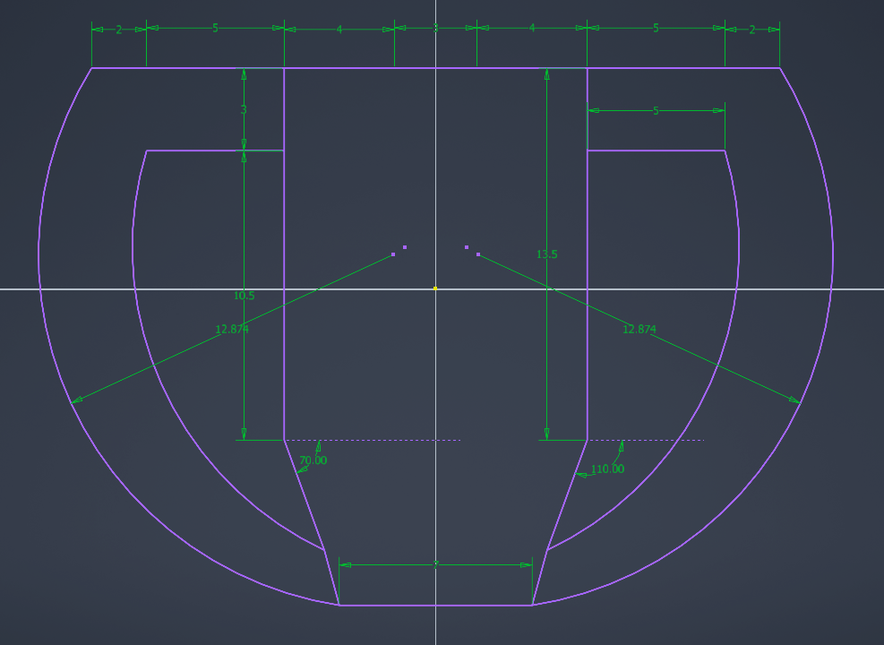
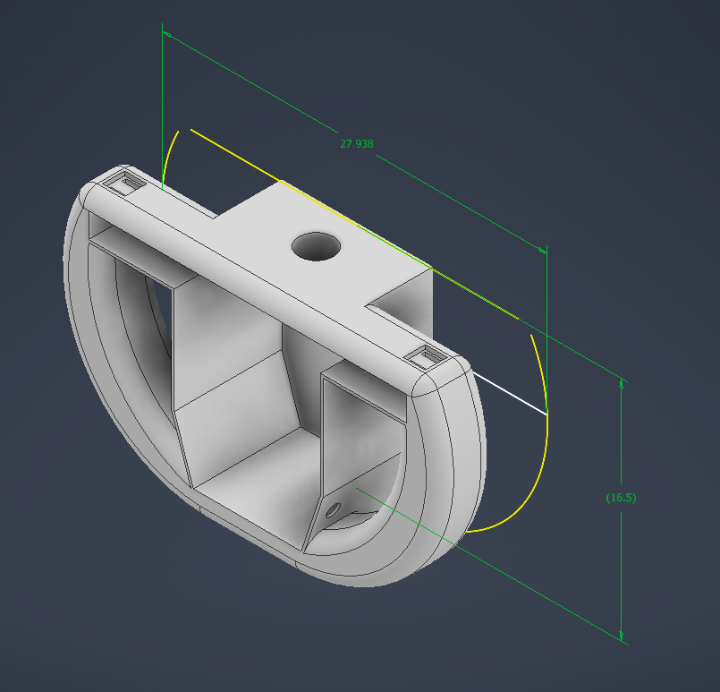
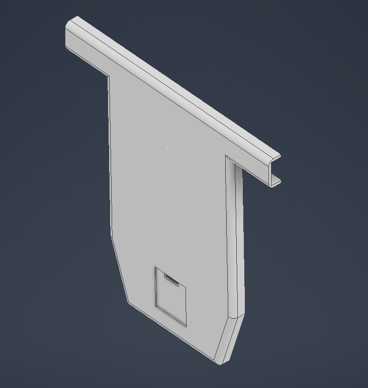

## 설계 목적
기존의 만능 기판 위에 부착했던 버튼과 모듈들을 외부 충격으로부터 보호하고, '핸들 컨트롤러'라는 목적성에 맞는 견고한 형태로 제작하기 위해 케이스를 설계함. 최종 결과물은 3D 프린팅으로 출력.
- 사용 프로그램: Autodesk Inventor
> 사용 프로그램 : Autodesk Inventor

## 설계도

## 모델링 결과

### 아쉬운 점
모듈 부품의 조립(어셈블리) 과정에서 실제 치수 측정에 어려움이 있었습니다. 이 때문에 모듈 배치 공간을 넉넉하게 잡았다고 생각했으나, 3D 프린팅 출력 후 실제 모듈을 결합해 보니 구상했던 것보다 공간이 협소하여 아쉬움이 남았습니다.
