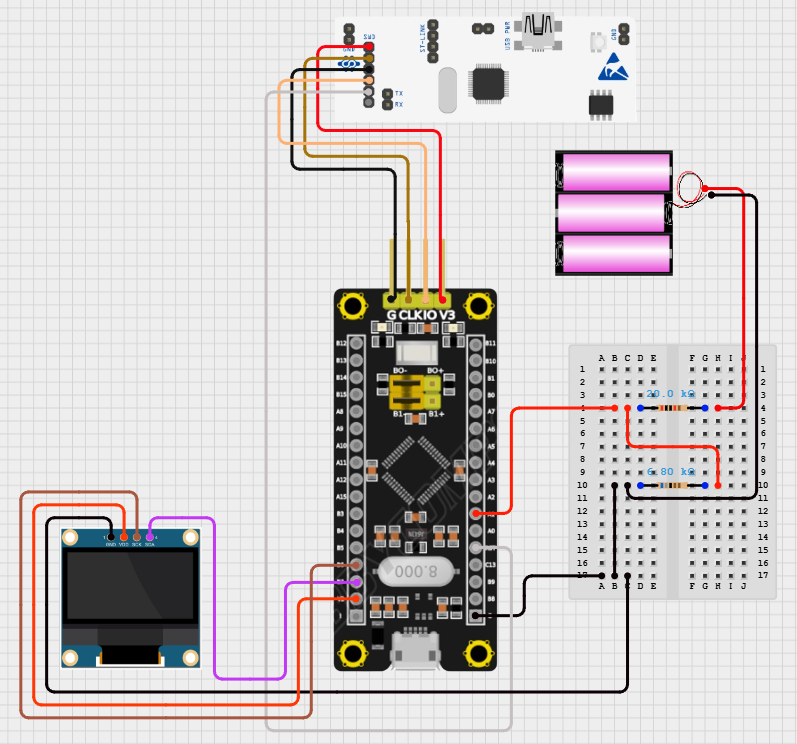

# 선형 보간 방식 기반 ADC 배터리 측정 후 OLED 출력 로직

## 🔄 변경사항
기존 배터리 잔량 측정 LCD 모니터링 로직(Lcd_Battery_Check.md)에서 LCD -> OLED로 변경

디스플레이를 SSD1306 기반 OLED 디스플레이로 교체함으로써, 차량 내 디스플레이의 시인성 및 사용자 인터페이스 품질을 향상시킬 수 있으며, OLED는 자체 발광 특성으로 인해 백라이트가 불필요하며, 높은 명암비와 시야각을 제공하여 주·야간 모두에서 뛰어난 가독성을 보장한다는 이점이 있다. 전과 마찬가지로 I2C 통신 기반으로 STM32와의 연결이 간편하며, 전력 효율과 디자인 자유도 면에서 기존 LCD 대비 확실한 이점을 제공하기 때문에 교체를 선택하였다.

> [이전 LCD 배터리 측정 로직 문서 참고](./Lcd_Battery_Check.md)

## 🔌 하드웨어 연결 변경사항



|OLED display|F103보드|
|:---:|:---:|
|Vcc|3.3V|
|Gnd|Gnd|
|SDA|B7|
|SCL|B6|

---

## ⚙️ STM32CubeMX 설정 변경사항

- connectivity<br>
i2c1 > speed : 400kHz (fast mode)

- Library 추가
```text
Core/
├── Inc/
│   ├── fonts.h
│   └── ssd1306.h
└── Src/
    ├── fonts.c
    └── ssd1306.c
```

---
## 💻 코드 변경 사항
1. main 함수
```c
// OLED 초기화
  SSD1306_Init();
  SSD1306_Clear();
  SSD1306_UpdateScreen();  // 초기 클리어 반영

  // HAL_GetTick()을 이용하여 비차단(non-blocking) 방식으로 주기적으로 OLED를 업데이트
  uint32_t last_update_time = HAL_GetTick(); 

  while (1)
  {
	 uint32_t now = HAL_GetTick();

	 if (now - last_update_time >= 1000)  // 1초 경과 시
	 {
		 last_update_time = now;

		 float vout = 0.0f;
		 float percent = Read_Battery_Percentage(&vout);

		 uint8_t display_percent = (uint8_t)(percent + 0.5f);  // 소수점 반올림

		 char buffer1[20], buffer2[20]; // OLED에 출력할 텍스트 버퍼
		 snprintf(buffer1, sizeof(buffer1), "BAT: %3d%%", display_percent);
		 snprintf(buffer2, sizeof(buffer2), "VOL: %.2fV", vout);

		 SSD1306_Clear();
		 SSD1306_GotoXY(0, 0);
		 SSD1306_Puts(buffer1, &Font_11x18, 1);

		 SSD1306_GotoXY(0, 20);
		 SSD1306_Puts(buffer2, &Font_11x18, 1);

		 SSD1306_UpdateScreen();
	 }
  }
```


