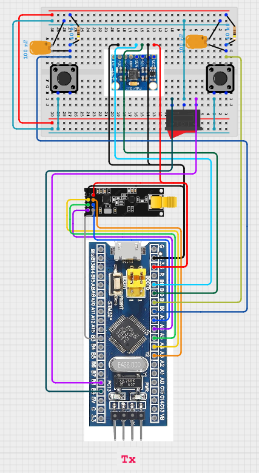
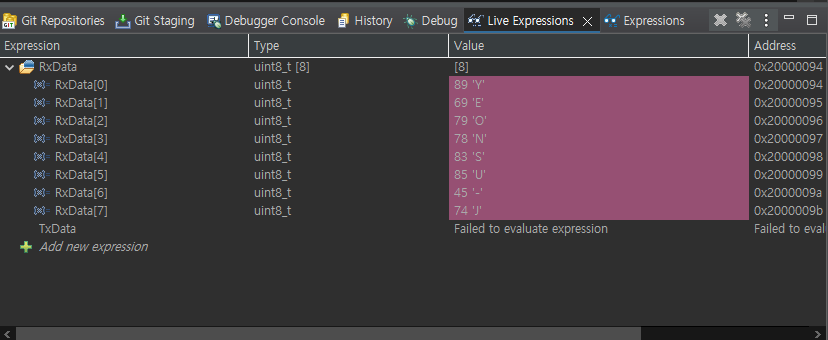
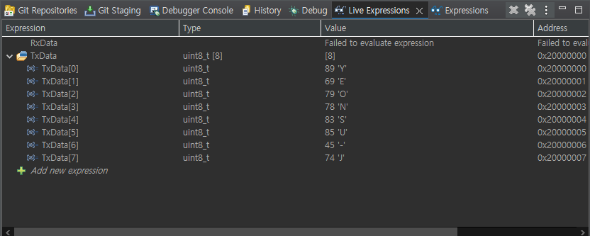
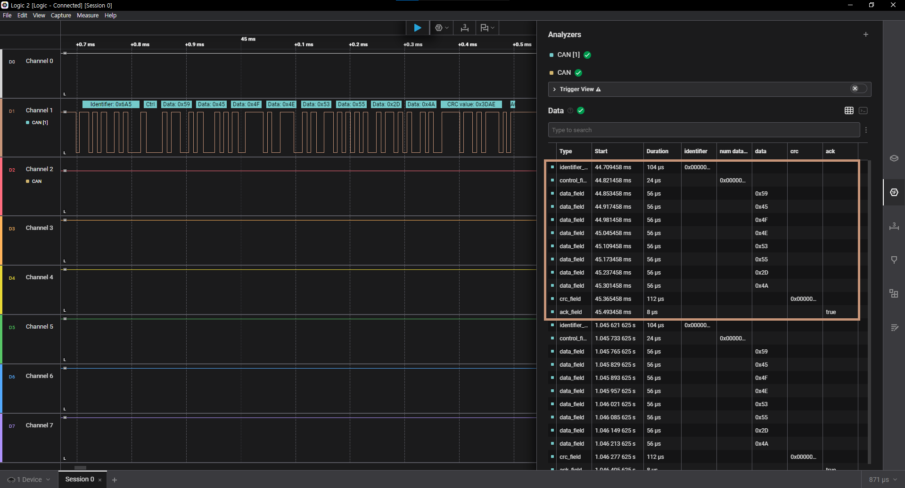
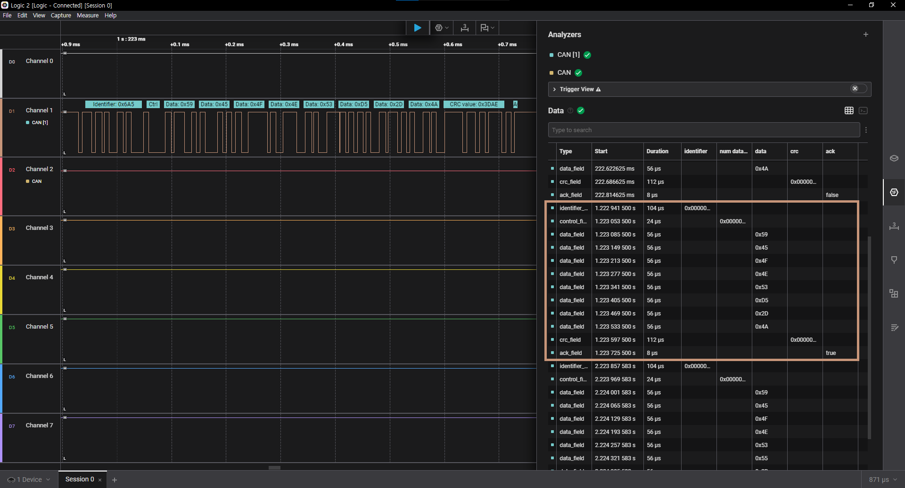

#  CAN 통신 송/수신 초기 기능 구현 (m3)

## 🎯 프로젝트 활용 방안
can 통신은 프로젝트에서 어떻게 활용할 것인가?

## 📖 이론 개요
can통신이란?

can 통신 동작 원리

사용한 can 트랜시버
트랜시버를 왜 사용해야하나?
왜 이 제품을 사용했나?

---

## 🔌 하드웨어 연결

### 송신부(Rx)

- 각 종단의 노드에 위치하는 모듈의 can_H와 can_L에는 종단저항을 120옴씩 연결해서 총저항의 값이 60옴이 되도록 만들어야한다.
-> 왜?

※ 수신부(Rx)는 [V1.0.0_RF_MotorCtrl.md](./V1.0.0_RF_MotorCtrl.md)와 동일

---

## ⚙️ STM32CubeMX 설정

### CAN bit timing 설정

CAN bit timing calculator 사이트
http://www.bittiming.can-wiki.info/

좋습니다. STM32F103의 시스템 클럭을 최대인 72 MHz로 설정했다면, CAN 통신에 사용되는 CAN 클럭 (bxCAN의 입력 클럭) 은 APB1 클럭에 기반합니다. 이 차이점을 먼저 이해하는 것이 중요합니다.

🔧 [1] bxCAN의 Clock Rate은 APB1 클럭 기준입니다
STM32F103 시리즈에서는 다음이 기본 설정입니다:
시스템 클럭 (SYSCLK) = 최대 72 MHz
APB1 클럭 (PCLK1) = SYSCLK / 2 = 36 MHz (제한 때문: APB1 최대 36 MHz)
CAN의 클럭 입력 소스 = PCLK1 = 36 MHz
📌 따라서, Clock Rate 필드에는 36을 입력하는 것이 정답입니다.

✅ 요약
항목	설정
System Clock	72 MHz
APB1 Clock (PCLK1)	36 MHz
CAN 클럭 소스	36 MHz
Clock Rate 필드에 넣을 값	36

다음 단계
CAN을 500kbps로 설정하려면:
Clock Rate: 36
Bit Rate: 500
Sample-Point: 87.5
SJW: 1

으로 설정 후 “Request Table”을 눌러 추천되는 Prescaler, BS1, BS2 값을 사용하시면 됩니다.

-> 결과 사진 캡쳐하기

> 참고 https://www.micropeta.com/video115

---

## 💻 동작 코드
다음은 ~한 코드이다.

#### 루프백모드를 통해 내장 CAN controller 정상 동작 확인
CAN의 **루프백 모드(Loopback Mode)**는 자기 자신에게 전송한 CAN 메시지를 수신하는 테스트용 모드입니다. 실제 네트워크 버스(CAN 트랜시버, 다른 노드)는 전혀 사용하지 않습니다.

✅ 루프백 모드란?
Loopback Mode는 CAN 컨트롤러 내부에서만 데이터 전송/수신이 일어나는 모드로, 물리적인 CAN 라인(H/C, L/C) 없이도 전송/수신 동작을 자기 자신과만 테스트할 수 있게 해줍니다.

✅ 동작 방식
일반 모드	루프백 모드
TX → 트랜시버 → CAN Bus → RX	TX → 내부 회로 → RX
실제 송수신 발생	물리적인 송수신 없음
다른 노드가 메시지 수신 가능	본인만 메시지 수신함

✅ 루프백 모드의 한계
한계	설명
네트워크 테스트 불가	다른 노드와의 실제 통신은 테스트 불가능
트랜시버/버스 상태 무시	전기적 특성, 종단저항, 오류 등 고려 못 함

✅ 결론
루프백 모드는 CAN 컨트롤러가 정상적으로 동작하는지 내부적으로 확인하기 위한 유용한 자기 테스트용 모드입니다. 하드웨어 없이 CAN 송수신 코드 검증이 가능하며, 초기에 매우 유용합니다.

#### 코드

#### 1. 송신부(Tx)

#### 2. 수신부(Rx)

- can filter란?, 왜 쓰는건지, 어떻게 설정하는건지
- 그밖의 함수 등
- 주소 설정 방법

### 통신 결과
- 로직 애널라이저, live expressions 등 사진 4개 첨부 

---

## 💡 향후 확장 및 개선 아이디어
- CAN 기반 센서부에서 측정된 초음파 거리값 환산 데이터 -> 차량부 햅틱 제어 (향후 RF로 차량부에서 핸들부로 전송예정)
- CAN timing parameter 중 prescaler 값을 조정하여 기존보다 빠른 500kbps 고속 CAN 통신을 구현, 통신 지연 최소화 및 실시간성 향상
- FreeRTOS 기반 CAN 통신 모듈화 및 태스크 분리
