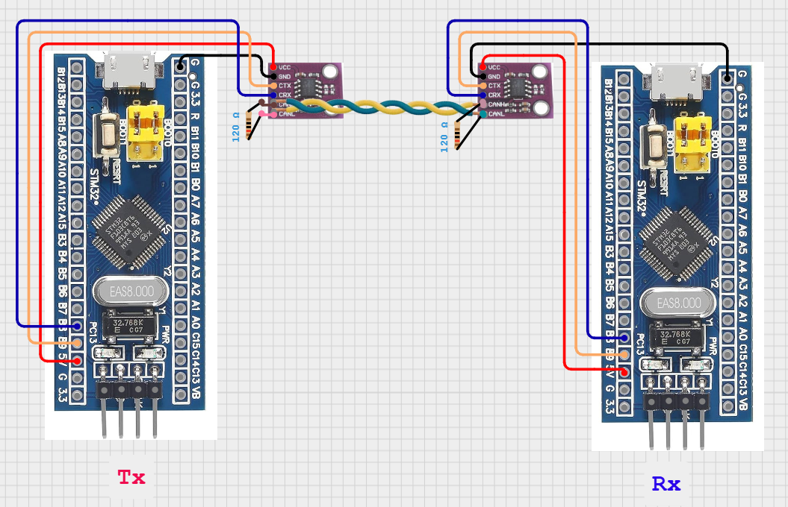

#  CAN 통신 송/수신 초기 기능 구현

## 🎯 프로젝트 활용 방안
CAN 통신은 본 프로젝트에서 다수의 마이크로컨트롤러 간 신뢰성 높은 데이터 교환을 위해 핵심적으로 활용된다. 현재 차량의 센서부에서 측정한 전·후방 초음파 센서 거리 데이터는, RF 통신을 통해 핸들부로 전송되기 전에 RF 송·수신 모듈이 탑재된 중앙제어부로 먼저 전달되어야 하며, 이 과정에서 CAN 통신이 사용된다. 또한 CAN의 브로드캐스트 특성을 활용하면, 향후 배터리 모니터링, 온도 센서 등 다양한 모듈을 추가하더라도 동일한 버스 상에서 통신 인프라를 확장성 있게 유지할 수 있다. 따라서 CAN 통신은 이 프로젝트에서 모듈 간의 분산제어 구조와 실시간 반응성을 확보하기 위한 필수 요소로 작용한다.

## 📖 이론 개요
### CAN 통신이란?
CAN(Controller Area Network) 통신은 차량 내부의 전자 제어 장치들(ECU) 간 고속·고신뢰성 데이터 전송을 위해 개발된 직렬 통신 프로토콜이다. 독일 Bosch사가 1980년대에 개발했으며, 현재는 자동차뿐만 아니라 산업 자동화, 의료기기, 로봇 시스템 등 다양한 임베디드 시스템에 널리 사용되고 있다.

### CAN 통신의 동작 원리
- 버스형 구조: 모든 노드가 하나의 CAN 버스에 연결되어 있으며, 중앙 제어 장치 없이 각 노드가 자율적으로 통신한다.
- 메시지 기반 프로토콜: 노드들은 메시지 ID를 기준으로 데이터를 송수신하며, 수신자는 해당 ID에 맞는 메시지만 필터링해 처리한다.
- 우선순위 기반 중재: 여러 노드가 동시에 전송을 시도하면, ID가 낮을수록 높은 우선순위를 가지며 충돌 없이 전송된다.
- 에러 검출과 재전송: CRC, ACK, 에러 플래그 등을 통해 오류를 검출하고, 자동으로 재전송하여 신뢰성을 확보한다.
- 전송 속도: 최대 1Mbps까지 지원하며, 네트워크 길이와 속도 간에는 상호 트레이드오프가 존재한다.

### 사용한 CAN 트랜시버 모듈
본 프로젝트에서는 TJA1051 최대 1Mbps 이상의 고속 통신을 지원하는 CAN 트랜시버가 탑재된 모듈을 사용하였다. 이 트랜시버는 기존의 TJA1050에 비해 EMC(전자파 적합성) 성능 강화, ESD(정전기 방전 보호) 기능 개선, 정지 전류 감소 및 전력 효율성 향상 등이 개선되었다.

특히 본 프로젝트는 초음파 센서의 거리 정보를 기반으로 햅틱 피드백을 핸들에 전달하는 실시간 시스템이기 때문에, 최소 500kbps 이상의 전송 속도가 요구된다. 이에 따라 높은 데이터 속도와 안정성이 보장되는 TJA1051 모듈을 채택하는 것이 적절하다고 판단하였다.

### 트랜시버란 무엇이며, 왜 사용하는가?
트랜시버(Transceiver)는 송신기(Transmitter)와 수신기(Receiver)의 합성어로, MCU와 물리적인 CAN 버스 사이를 연결하는 물리 계층(PHY) 역할을 수행한다. 그 주요 목적은 다음과 같다:
- MCU의 로직 레벨(3.3V/5V)을 CAN 버스 신호 레벨로 변환
- 차동 신호(CAN_H, CAN_L)로 데이터를 송수신
- 잡음 억제 및 외란(EMI/ESD) 보호
- 물리적 충돌 없이 여러 노드와 안정적인 데이터 송수신 가능

차량부에서 사용하는 STM32F103C8T6 자체에는 CAN 컨트롤러가 내장되어 있어 프레임 생성, ID 설정, 필터링 등 논리 계층(Layer 2) 처리를 수행할 수 있지만, 이를 실제 물리적 CAN 네트워크에 연결하기 위해서는 트랜시버가 반드시 필요하다. 트랜시버는 전기적 특성 정합, 차동 신호 생성, 외부 간섭 차단 등의 역할을 수행하며, 신뢰성 있는 통신을 구현하는 데 핵심적인 부품이다.

하지만 트랜시버 모듈 없이도 mcu에 내장된 can 컨트롤러가 잘 동작하는지 확인할 수 있는데, 바로 루프백 모드를 사용하는 것이다. 

### 루프백 모드(Loopback Mode)란?
루프백 모드는 트랜시버 없이도 CAN 통신의 내부 로직을 테스트할 수 있는 기능이다. 이 모드는 다음과 같은 특징을 가진다:
- CAN 컨트롤러 내부에서 송신한 메시지를 곧바로 수신하도록 루프를 형성함
- 물리적인 트랜시버나 배선 없이도 소프트웨어적으로 송·수신 코드의 동작 확인 가능
- 외부 노이즈나 충돌이 발생하지 않으며, 단일 노드 테스트용으로 적합
- 실질적인 통신 품질이나 물리 계층 검증은 불가능

이 모드는 일반적으로 초기 펌웨어 개발 단계에서 유용하며, 송수신 코드의 논리적 흐름, 인터럽트 처리, 필터 설정 등을 확인할 때 사용된다. 하지만 실제 다중 노드 간 통신이나 노이즈 환경에서의 신뢰성 검증은 트랜시버를 통한 실환경 테스트가 필수적이다.

---

## 🔌 하드웨어 연결



### CAN 버스의 양 끝단에 종단저항으로 120옴을 연결하는 이유 
CAN 통신은 차동 신호(differential signaling)를 사용하는 버스형 통신 방식이다. 이 방식에서 신호 품질과 안정성 유지를 위해 물리적인 버스 양 끝단(Terminal)에 120Ω 종단 저항을 반드시 연결해야 하며, 그 이유는 다음과 같다:

- 1. 반사파(Reflection) 제거
    - CAN 통신에서는 전압 신호가 버스를 따라 전송되는데, 버스의 끝단에 저항이 없으면 신호가 끝에서 반사되어 통신 신뢰성에 악영향을 준다.
    - 120Ω 종단 저항은 케이블 임피던스(약 120Ω)와 일치시켜 반사를 방지하며, 신호의 잔향 없이 안정적으로 소멸되게 한다.

- 2. 차동 신호의 임피던스 정합
    - CAN 버스는 차동 페어(CAN_H, CAN_L)로 구성되며, 전송선로의 특성 임피던스가 약 120Ω이다.
    - 각 종단에 120Ω 저항을 연결하면 회로 전체에서 병렬로 60Ω이 형성되어 신호 왜곡과 간섭을 최소화할 수 있다.

- 3. 노이즈 내성 및 실시간 통신 안정성 확보
    - 종단 저항은 신호의 파형을 안정화시키고, 외부 전자기 간섭(EMI)에도 강한 구조를 만들어 실시간성 요구가 높은 임베디드 시스템에 필수적이다.

### CAN_H와 CAN_L 선을 Twisted Pair로 구성해야 하는 이유
CAN 통신은 차동 신호 방식(differential signaling)을 사용하기 때문에, CAN_H와 CAN_L 두 신호선이 항상 동일한 간섭 환경에 놓이는 것이 중요하다. 이를 위해 두 선을 일정 간격으로 꼬아 주는 Twisted Pair 구조를 사용하는데, 그 이유는 다음과 같다:

- 1. 공통 모드 노이즈 제거
    - 외부에서 전자기 간섭(EMI)이 발생하면, 꼬이지 않은 선은 한 쪽 선에만 영향을 줄 수 있다.
    - 그러나 Twisted Pair는 두 선이 매우 가까운 거리에서 번갈아 가며 위치를 바꾸기 때문에 동일한 간섭이 양쪽 선에 동시에, 거의 같은 크기로 유입된다.
    - CAN 수신 회로는 두 선의 전압 차이만을 인식하므로, 동일하게 유입된 간섭은 차동 신호에서 자연스럽게 상쇄되어 제거된다.

- 2. 신호 무결성 향상
    - 신호 왜곡과 반사를 줄이고, 장거리에서도 정확한 전송 신호 유지가 가능하다.
    - 고속 통신(500kbps~1Mbps)일수록 선로 임피던스 정합과 노이즈 억제가 중요해지며, Twisted Pair는 이를 효과적으로 충족시킨다.

- 3. EMI 방사 최소화
    - 차동 신호는 두 선에 반대 방향으로 전류가 흐르므로, 전기장과 자기장이 서로 상쇄되어 외부로 방출되는 전자파가 적다.
    - Twisted Pair는 이러한 EMC(전자파 적합성) 요구사항을 만족시키는 중요한 물리적 설계 방식이다.

---

## ⚙️ STM32CubeMX 설정

### < Tx, Rx 공통 >
- Connectivity > CAN > Mode > Activated
- Parameter Settings
    - Prescalor > 72
    - Time Quanta in Bit Segment1 > 2 Times (Baud 125000)

※ 125 kbps는 초기 개발 및 디버깅 환경에 최적화된 안전한 통신 속도이며, 시스템이 안정화된 이후 실시간성이 필요한 상황(예: 센서→중앙제어부→핸들부 피드백)에서는 500 kbps 이상으로 CAN bit timing calculator 사이트를 통해 상향 조정할 것이다.

- PB9 > CAN_TX
- PB8 > CAN_Rx

### < Rx >
- NVIC Settings --> CAN RX1 Interrupt (tick)

※ CAN Rx에서는 NVIC 인터럽트를 활성화해야 MCU가 수신 이벤트를 실시간으로 감지하고 처리할 수 있다. CAN 컨트롤러는 메시지를 수신하면 내부 수신 FIFO에 저장하고 인터럽트를 발생시켜 이를 MCU에 알리며, 이 과정을 통해 실시간 데이터 처리와 수신 누락 방지가 가능해진다. 인터럽트를 사용하지 않으면 MCU는 지속적으로 수신 여부를 확인하는 폴링 방식에 의존하게 되어 CPU 자원을 비효율적으로 소모하게 되며, 수신 처리 지연 시 FIFO 오버플로우로 인한 데이터 손실이 발생할 수 있다. 따라서 Rx에서 NVIC 인터럽트를 활성화하는 것은 실시간성, 처리 효율성, 통신 안정성을 모두 확보하기 위한 필수적인 설정이다.

> 참고 링크 : https://www.micropeta.com/video115<br>
> CAN bit timing calculator 사이트 : http://www.bittiming.can-wiki.info/

---

## 💻 동작 코드

### 1. 송신부(Tx)

#### 주요 기능 설명
- CAN 통신을 시작
- 송신 메시지 헤더 구성
- 특정 ID와 데이터("YEONSU-J")를 반복적으로 전송

#### 코드 설명
```c
CAN_TxHeaderTypeDef TxHeader; // TxHeader: 송신 프레임의 정보(ID, 타입 등)를 담는 구조체
uint32_t TxMailbox; // TxMailbox: 송신 메일박스 핸들
uint8_t TxData[8]="YEONSU-J"; // TxData: 전송할 데이터 (8바이트)
```
메세지 헤더 구성
```c
HAL_CAN_Start(&hcan); // can 통신 시작
TxHeader.DLC = 8;  // 데이터 길이 (8바이트)
TxHeader.IDE = CAN_ID_STD; // 표준 ID 사용 (11비트)
TxHeader.RTR = CAN_RTR_DATA; // 데이터 프레임 전송
TxHeader.StdId = 0x6A5;  // 송신할 메시지의 ID (ID can be between Hex1 and Hex7FF (1-2047 decimal))
```
무한 루프를 통해 동일한 메시지를 지속적으로 송신
```c
while (1)
{
    HAL_CAN_AddTxMessage(&hcan, &TxHeader, TxData, &TxMailbox);
}
```

### 2. 수신부(Rx)

#### 주요 기능 설명
- CAN 필터 설정
- 수신 인터럽트 활성화
- 콜백 함수로 메시지를 수신하고 처리

#### 코드 설명
```c
CAN_FilterTypeDef sFilterConfig; // sFilterConfig: 수신 필터 설정 구조체
CAN_RxHeaderTypeDef RxHeader;
uint8_t RxData[8]; // RxData: 수신 데이터를 저장할 배열
```
콜백함수 : 수신처리
- 수신 이벤트가 발생했을 때 호출되는 인터럽트 콜백
- FIFO1에서 메시지를 읽어 RxHeader와 RxData에 저장
```c
void HAL_CAN_RxFifo1MsgPendingCallback(CAN_HandleTypeDef *hcan)
{
  HAL_CAN_GetRxMessage(hcan, CAN_RX_FIFO1, &RxHeader, RxData);
}
```
필터 및 인터럽트 설정
- ID 0x6A5인 메시지만 필터링하여 FIFO1으로 수신
```c
HAL_CAN_Start(&hcan); // can 수신 시작

// Configure the filter
sFilterConfig.FilterActivation = CAN_FILTER_ENABLE;
sFilterConfig.FilterFIFOAssignment = CAN_FILTER_FIFO1;
sFilterConfig.FilterMode = CAN_FILTERMODE_IDMASK;
sFilterConfig.FilterIdHigh = 0x6A5<<5; // 수신 대상 ID 설정
sFilterConfig.FilterIdLow = 0;
sFilterConfig.FilterMaskIdHigh = 0x7FF<<5; // // 마스크: 모든 비트 비교 (SET 0 to unfilter)
sFilterConfig.FilterMaskIdLow = 0;
sFilterConfig.FilterScale = CAN_FILTERSCALE_32BIT;
HAL_CAN_ConfigFilter(&hcan, &sFilterConfig); // 필터 설정 적용

// 수신 인터럽트 활성화 (Activate the notification)
HAL_CAN_ActivateNotification(&hcan, CAN_IT_RX_FIFO1_MSG_PENDING);
```


- can filter란?, 왜 쓰는건지, 어떻게 설정하는건지
- 그밖의 함수 등
- 주소 설정 방법


### 통신 결과
- Logic 2 소프트웨어와 로직 분석기를 이용하여 물리적인 CAN 신호(CAN_H, CAN_L)의 타이밍과 프레임 구조를 분석하였고, 동시에 STM32CubeIDE의 Live Expressions 기능을 통해 변수 수준에서의 송수신 데이터 흐름을 실시간으로 확인함으로써, CAN 통신의 동작을 직관적으로 가시화하였다.

#### Live Expressions Capture
Tx<br>
<br>
Rx<br>
<br>

-> "YEOSU-J"라는 데이터가 수신된 것을 확인할 수 있다.

#### Logic Analyzer Capture

- Logic 2 로직 분석기를 통해 CAN 수신 메시지 프레임의 구조를 각 필드별로 시각적으로 확인할 수 있으며, 각 필드의 시작 시간, 지속 시간, 값을 디코딩 된 것도 확인할 수 있다.

Tx<br>
<br>
Rx<br>
<br>

각 필드의 의미와 역할<br>

- 1. Identifier (식별자 필드)
    - 역할: 메시지의 ID를 나타냄. 각 메시지는 이 ID를 통해 우선순위가 정해지고, 수신 측에서는 필터링에 사용됨.
    - 해당 캡처: Identifier: 0x6A5
    → 표준 ID (11비트) 방식으로, 송신 측에서 설정한 ID와 정확히 일치함.

- 2. Control Field (제어 필드)
    - 역할: 데이터 길이(DLC: Data Length Code) 등 프레임 구조를 정의
    - 해당 캡처: DLC = 8
    → 수신 메시지는 총 8바이트 데이터를 포함하고 있음을 의미함.

- 3. Data Field (데이터 필드)
    - 역할: 실제 송신하려는 데이터가 이 영역에 위치. 최대 8바이트(클래식 CAN 기준).
    - 해당 캡처: 0x59 (Y), 0x45 (E), 0x4F (O), 0x4E (N), 0x53 (S), 0x55 (U), 0x2D (-), 0x4A (J)
    → "YEONSU-J" 문자열 그대로 수신된 것을 확인할 수 있음.

- 4. CRC Field (오류검출 필드)
    - 역할: 송신자가 계산한 CRC 값을 포함. 수신 측에서 동일 계산 후 비교하여 데이터 오류 검출에 사용됨.
    - 해당 캡처: CRC value: 0x3DAE
    → 정상적인 CRC 값이 포함되어 있으며, 에러 없이 처리된 것을 의미함.

5. ACK Field (응답 필드)
    - 역할: 메시지를 정상 수신한 노드가 ACK 슬롯에 0을 넣음으로써 송신자에게 수신 성공을 알림.
    - 해당 캡처: ack: true
    → 수신 측(Rx)에서 이 프레임을 정상적으로 수신했음을 의미하며, 송신 측에서는 다음 메시지를 보낼 준비가 가능해짐.
---

## 💡 향후 확장 및 개선 아이디어
- CAN 기반 센서부에서 측정된 초음파 거리값 환산 데이터 -> 차량부 햅틱 제어 (향후 RF로 차량부에서 핸들부로 전송예정)
- CAN timing parameter 중 prescaler 값을 조정하여 기존보다 빠른 500kbps 고속 CAN 통신을 구현, 통신 지연 최소화 및 실시간성 향상
- FreeRTOS 기반 CAN 통신 모듈화 및 태스크 분리
