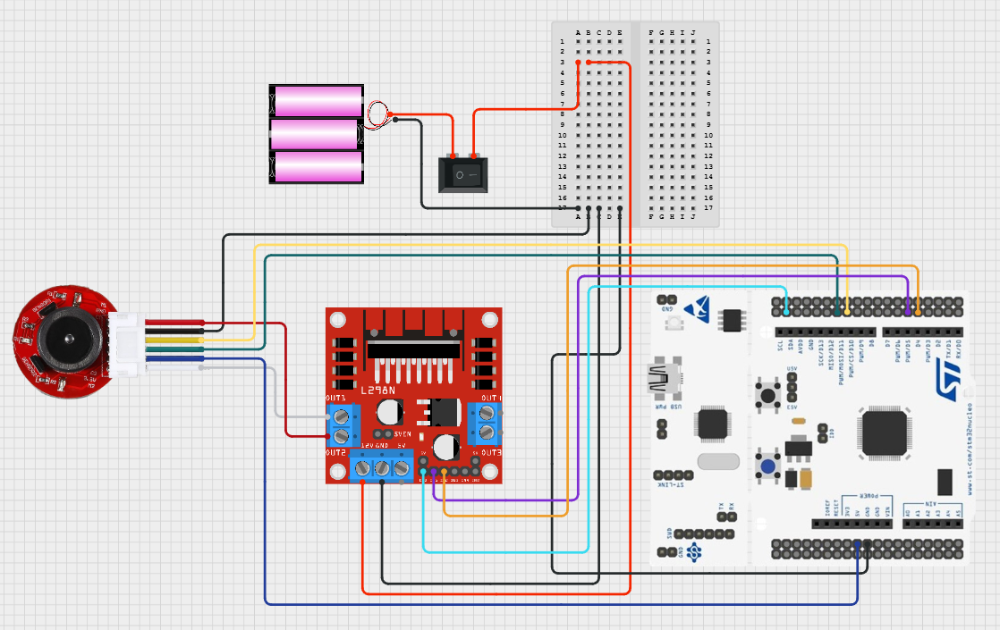

# [JGA25-370] PWM + 엔코더 기반 DC모터 동작 및 RPM 측정 로직 구현

## 🎯 프로젝트 활용 방안
본 프로젝트에서 DC 모터는 차량의 후륜 구동을 담당하며, 모터에 부착된 인코더를 통해 속도(RPM)와 회전 방향(전진/후진)을 측정한다. 측정된 정보는 주행 중 핸들에 부착된 OLED 디스플레이를 통해 실시간으로 확인할 수 있다.

---

## 📖 이론 개요

### 1. JGA25-370 DC모터 with 인코더 동작 원리

#### 모터 사양
- Rated Volt : 12v
- Reduction ratio : 21.3:1
- No Load(무부하)
    - speed : 280rpm<br>
	- current : 60mA<br>
- At Load(부하)
    - Torque : 0.5KG.cm
	- speed : 220rpm
	- current : 0.45A
- Stall 
    - TOGQCE : 1.7KG..CM
	- current : 1.3A

#### DC모터 동작원리
- JGA25-370과 같은 브러시드 DC 모터는 입력 전압의 크기에 따라 회전 속도가 변하는 구조를 가지며, 이를 효율적으로 제어하기 위해 일반적으로 PWM(Pulse Width Modulation, 펄스 폭 변조) 방식이 사용된다.
- PWM 방식은 전압을 아날로그처럼 연속적으로 제어하는 대신, 디지털 신호의 ON/OFF 시간을 조절함으로써 모터에 **전력 공급의 평균값(평균 전압)**을 바꾸는 방식이다. 
    - 예를 들어, 100% 듀티 비는 전압이 계속 공급되는 상태(12V), 50% 듀티 비는 절반 시간만 공급되어 평균 약 6V, 10% 듀티 비는 약 1.2V의 평균 전압 효과를 내게 된다. 이에 따라 모터의 속도도 비례적으로 달라지게 된다.

- 다만, JGA25-370은 감속 기어가 포함된 고토크 저속 모터이기 때문에, 회전 시작 시 관성이 커서 일정 이상의 전압이 인가되어야 실제로 회전을 시작할 수 있다. 일반적으로 듀티 비 20~25% 이하에서는 모터가 회전하지 않고 데드존(Dead Zone) 현상이 발생해 소음만 존재하며, 실제 속도 제어가 되지 않는다. 따라서 유효한 제어 범위는 이 이상에서 시작된다.

- 하지만 너무 빠른 PWM 주파수는 감속기의 반응 속도나 모터의 기계적 특성 때문에 각 펄스의 세부적인 전력 변화에 모터가 민감하게 반응하지 못해, 오히려 제어 해상도가 떨어질 수 있다. 특히 JGA25-370과 같이 감속기가 포함된 고관성 모터는 회전 반응이 느리기 때문에 고주파 PWM의 빠른 듀티비 변화는 기계적으로 무시되거나 평균값으로만 반영되는 경우가 많다.
- 따라서 PWM 주파수는 모터가 실제로 반응할 수 있는 범위 내에서 설정하는 것이 중요하다. 일반적으로 브러시드 DC 모터의 경우 1kHz~20kHz 사이에서 동작하며, 너무 낮은 주파수는 출력이 끊기는 듯한 느낌을 줄 수 있고, 너무 높은 주파수는 실제 제어 효과가 무뎌지므로, 실험적으로 모터의 회전 반응성과 소음 수준을 고려해 최적 주파수를 선정해야 한다.


#### 홀 센서 방식의 회전 인코더
- JGA25-370 DC 모터에 장착된 인코더는 홀 센서 방식의 회전 인코더로, 회전축에 부착된 자석과 이를 감지하는 두 개의 고정된 홀 센서를 이용해 회전 속도와 방향을 측정한다. 회전 시 자석의 자기장 변화에 따라 홀 센서가 홀 전압을 발생시키고 이를 디지털 펄스로 변환하여 출력하며, 두 센서(A상, B상) 간의 위상차를 분석함으로써 회전 방향을 판단할 수 있다. 생성된 펄스 수를 시간에 따라 카운트하면 회전 속도(RPM)를 계산할 수 있다. 
- 홀 센서 방식은 해상도 면에서는 광학식보다 낮지만, 먼지, 진동, 오염에 강해 내구성이 뛰어나며, 산업용 및 차량용 모터 제어 시스템에 널리 사용된다.

##### 인코더 기본 구성
- 자석(Magnet): 모터 축에 부착되어 회전함
- 홀 센서(Hall Sensor): 자석의 N/S극 변화에 따른 자기장 변화를 감지하여 디지털 펄스를 출력

##### 인코더의 속도 측정 원리
1. 모터 회전 시, 자석이 홀 센서를 통과할 때마다 펄스 1개가 발생함
2. 일정 시간 동안 발생한 펄스 수를 세어 회전수를 계산함
3. 이를 바탕으로 회전속도(RPM)를 계산:
```text
RPM = (펄스 수 / TICKS_PER_REV) × (1초 / 측정 주기) × 60
```
- TICKS_PER_REV: 감속기 포함 실제 출력축 한 바퀴당 펄스 수
- STM32에서는 타이머 인터럽트나 주기 타이머를 통해 펄스 카운트를 주기적으로 측정함

##### 인코더의 방향 측정 원리 (쿼드러쳐(Quadrature) 기법)
   
|A상 신호|B상 신호|변화 순서|방향|
|:---:|:---:|:---:|:---:|
|↑|→|A상 상승 -> B상 상승|정방향 (CW)|
|→|↑|B상 상승 -> A상 상승|역방향 (CCW)|
- 회전 인코더에서 두 개의 홀 센서 신호 A상과 B상이 90도 위상차를 가지고 변화하면서, 신호 변화 순서에 따라 회전 방향을 측정할 수 있음

- 이 두 신호를 사용하면 펄스당 4번의 카운팅 (A 상승, A 하강, B 상승, B 하강)이 가능해져 4배 해상도의 정밀한 카운팅이 됨 **(x4 모드)**

- STM32의 Encoder 인터페이스 모드에서는 이 위상차를 자동으로 감지해 카운터 증가/감소로 방향을 판단


### 2. L298N 모터 드라이버 원리 (H-Bridge 방식)
L298N은 STMicroelectronics에서 제작한 듀얼 H-Bridge 모터 드라이버로, DC 모터나 스테퍼 모터를 양방향 제어하기 위해 설계되었다. 내부에는 두 개의 BJT 기반 H-Bridge 회로가 내장되어 있어, 하나의 L298N 칩으로 DC 모터 2개 혹은 스테퍼 모터 1개를 제어할 수 있다.

#### H-Bridge 기본 이론
H-Bridge 회로는 4개의 스위칭 소자(트랜지스터 또는 MOSFET)를 "H"자 형태로 배치하여, 전류의 방향을 양쪽으로 바꿀 수 있는 구조이다.

- 전류 방향 전환: 특정한 두 개의 스위치를 동시에 켜면 모터의 한 방향으로 전류가 흐르고, 다른 쌍을 켜면 반대 방향으로 흐름 → 모터 회전 방향 제어 가능

- PWM 제어: 상단 또는 하단의 트랜지스터 쌍에 PWM 신호를 입력하면, 전력의 평균값을 조절해 속도 제어가 가능함

#### PWM 주파수와 관련된 특성
L298N은 일반적으로 2kHz ~ 5kHz 사이의 PWM 주파수에서 안정적으로 동작하며, 이 범위를 벗어나면 다음과 같은 문제가 발생할 수 있다:

- 1kHz 이하의 저주파 : 모터 진동, 고주파 소음, 부드럽지 못한 회전 
- 10~20kHz의 고주파 : BJT의 스위칭 손실 증가 → L298N 발열 심화
출력 토크 감소, 효율 저하

※  Datasheet에서도 PWM 주파수에 대한 명시적인 권장치는 없지만, BJT 기반 스위칭 소자의 스펙과 실제 실험 결과를 보면 2~5kHz가 최적 동작 범위로 평가됨.

#### 왜 L298N은 고속 PWM에 적합하지 않은가?
- 스위칭 손실 증가: BJT는 MOSFET보다 on/off 시간이 느려, 빠른 PWM(예: 20kHz 이상)에서는 과도한 열 손실이 발생함

- 출력 저하: 빠른 스위칭 속도를 따라가지 못해 PWM 듀티비에 따른 출력 반응이 무뎌지고, 모터 토크가 줄어듦

- 발열 위험: 히트싱크 없이 사용 시, 고속 PWM + 고전류 조합은 **L298N 발열에 의한 열 차단(thermal shutdown)**을 유발할 수 있음


> [JGA25-370 datasheet](../datasheets/[JGA25-370]dc_motor_datasheet.pdf)<br>
> [L298N datasheet](../datasheets/[L298N]motor_driver_datasheet.pdf)<br>
> H-bridge 참고링크 : https://m.blog.naver.com/techref/222236636089<br>
> 인코더 참고링크 : https://blog.naver.com/gauya/220221704986
---

## 🔌 하드웨어 연결



|외부전원(5V)|L298N|F446RE보드|DC모터|
|:---:|:---:|:---:|:---:|
|+12V|+12v|||
|Gnd|Gnd|Gnd|encoder Gnd(black)|
||Out1||Motor-(white)|
||Out2||Motor+(red)|
||IN1|PB4||
||IN2|PB5||
||ENA|PB8||
|||+5v|encoder +5v(blue)|
|||PA7|encoder signal A(yellow)|
|||PA6|encoder signal B(green)|

- 그라운드는 공통으로 묶어줘야함
- 점퍼핀 제거 후 ENA에 STM32의 PWM 핀(PB8 등)을 연결하면 모터 속도 제어가 가능하다. 
- ENA를 HIGH로 고정한 상태에서는 속도 조절 없이 ON/OFF 및 방향 제어만 된다.


---  

## ⚙️ STM32CubeMX 설정

## 1. Pinout 설정
- PB4, PB5 -> GPIO_Output (L298N IN1,2)
- PB8 -> TIM4_CH3 (PWM Generation)
- PA6 -> TIM3_CH1 (Encoder A)
- PA7 -> TIM3_CH2 (Encoder B)

### 2. TIM4 설정 - PWM
- Clock Source: Internal Clock
- Channel 3: PWM Generation CH3
- Configuration
    - Prescaler : 90-1 
    - Counter Period (ARR) : 1000-1


#### < TIM4의 타이머 클럭 계산 >
TIM4는 APB1 타이머에 속하며, STM32F4 시리즈의 규칙에 따라 :

- APB1 Prescaler ≠ 1일 경우, 타이머 클럭 = APB1 클럭 × 2

STM32CubeMX의 기본 설정에서 :

- APB1 Prescaler = 4
- APB1 클럭 = 45MHz
- -> 타이머 클럭 = 45MHz × 2 = 90MHz

타이머에서 Prescaler = 89 설정 시:

- -> 타이머 주기 클럭 = 90MHz / (89 + 1) = 1MHz

즉, 1µs 주기로 카운팅됨.

#### < PWM 주파수 계산을 통한 ARR 설정  > 

- ARR(= Auto-Reload Register) 값은 타이머의 최대 카운트 값을 나타내며,PWM의 분해능을 결정
- ARR 값이 클수록 듀티비를 미세하게 조절할 수 있어 속도 제어가 부드러워지지만 PWM 주파수는 낮아지게 됨
```latex
fpwm = ftimer / (ARR+1) x (PSC+1)
```
- RC카에서는 ARR을 999로 설정하면 약 10비트의 정밀도로 충분한 제어 성능을 확보하면서도 1kHz의 적절한 PWM 주파수를 유지할 수 있어, 제어 정밀도와 반응성의 균형을 효과적으로 맞출 수 있다.
 

```latex
ARR = (타이머 클럭 / PWM 주파수) -1
```
- 위에서 구한 타이머 클럭 = 1MHz (1µs)
- 따라서 1kHz의 PWM 주파수에 따른 ARR은 999(1000-1)가 된다.

### 3. TIM3 설정 - Encoder
- Combined Channels > Encoder Mode
- configuration > encoder mode TI1 and TI2

#### TIM3 Encoder 모드 설정
- 채널 A → TIM3_CH1 (PA6)
- 채널 B → TIM3_CH2 (PA7)

STM32는 하드웨어적으로 Quadrature Encoder 모드를 지원하며, 이를 활용하면 모터의 속도와 회전 방향을 정밀하게 측정할 수 있다.

- A상만 사용하는 경우: 
    - 상승 엣지에서만 펄스를 해석하므로 해상도가 제한됨
- A상 + B상 모두 사용하는 경우: 
    - 상승/하강 엣지뿐만 아니라 두 채널 간 위상 차이까지 고려할 수 있어, 보다 정확한 측정이 가능함

특히 A상과 B상을 모두 사용하는 Quadrature 방식에서는 1펄스당 최대 4카운트 (상승/하강 × A/B 채널)로 처리할 수 있어, 최대 4배 분해능의 해상도를 구현할 수 있다.

counter settings
- prescaler : 0
- Counter period(ARR) : 65535 or 0xFFFF (엔코더 overflow 방지)
- Counter Mode : UP

Encoder Input Configuration
- IC1 Polarity: Rising Edge
- IC1 Selection: Direct TI
- IC1 Prescaler: No division (1번마다 1번 인식 = 모든 엣지를 다 인식함)
- IC1 Filter: 10 (노이즈가 심하면 값을 올려줘야함)
- (IC2 항목도 동일하게 설정)


#### IC1/IC2의 Input Filter란?
IC1/IC2의 Input Filter는 엔코더 신호에 포함된 전기적 노이즈로 인해 발생할 수 있는 잘못된 펄스 감지를 방지하는 디지털 필터 기능이다. 고속 회전, 긴 배선, 주변 전자기 간섭 등으로 인해 노이즈가 유입되면 RPM 값이 튀거나 PID 제어가 불안정해질 수 있는데, 이를 방지하기 위해 STM32는 ICxFilter 값을 0부터 15까지 설정할 수 있다. 값이 클수록 더 강한 필터링이 적용되어 노이즈 제거에 효과적이지만 응답 속도는 약간 느려질 수 있으며, 일반적으로 1~15 사이의 값이 권장된다.


---
## 💻 코드 설명
동작요약 : 이 코드는 HAL_GetTick()을 이용한 논블로킹 상태머신으로 정방향, 정지, 역방향, 정지를 순차적으로 반복하며, 각 상태에서 L298N의 IN1/IN2와 PWM 듀티비를 조절해 모터를 구동하고, TIM3 인코더 값을 주기적으로 읽어 delta 기반 RPM과 방향을 계산 후 Live Expressions에 변수로 지정하여 실시간으로 출력한다.

### 1. PWM 제어 (TIM4 CH3 사용)
- PWM 주파수: 약 1kHz (Prescaler=90, ARR=999)
- CCR 범위: 300 ~ 999로 설정
    - CCR / 999 × 100% → 듀티비 환산 가능
    - 예: CCR=300이면 약 30% 듀티비
- 이유:
20~25% 이하의 듀티비에서는 데드존(Dead Zone) 현상이 발생하기 때문에 듀티비가 너무 낮으면 모터가 회전하지 않고 소음만 발생하므로, 실질적인 회전을 위해 CCR 최소값을 300으로 설정함

### 2. 속도 및 방향 측정 (TIM3 인코더 모드 사용)
- TIM3는 인코더 인터페이스 모드로 설정되어, 엔코더의 A/B상 신호를 자동 디코딩
- 20ms 주기로 다음을 수행:
    - delta: 현재 카운터 값 - 직전 값
    - motor_rpm: (delta / TICKS_PER_REV) × 10Hz × 60 → RPM 계산
    - 방향: __HAL_TIM_IS_TIM_COUNTING_DOWN() 함수로 정/역방향 판단

#### 오버플로우 보정
```c
int32_t delta = (int16_t)(enc - last_encoder);
```
- int16_t로 캐스팅함으로써 TIM3 카운터 오버플로우가 발생해도 자동 wrap-around 보정이 적용됨

```c
#define PPR 11
#define GEAR_RATIO 21.3f
#define TICKS_PER_REV (PPR * GEAR_RATIO * 4)
```
- TICKS_PER_REV = PPR × 감속비 × 4
- 결과적으로 단위 시간당 변화량을 바탕으로 RPM 계산
- 방향은 __HAL_TIM_IS_TIM_COUNTING_DOWN() 함수로 확인

### 3. 상태 전환 방식 (Non-blocking State Machine)
```c
static uint32_t state_durations[] = {5000, 2000, 5000, 2000};
```
- state 변수를 사용해 4가지 상태(정회전, 정지, 역회전, 정지)를 순환
|state|동작|듀티비|방향 설정(PB5/PB4)|
|:---:|:---:|:---:|:---:|
|0|정방향 회전|300|(1/0)|
|1|정지|0|(0/0)|
|2|역방향 회전|600|(0/1)|
|3|정지|0|(0/0)|
- 각 상태는 state_durations[] 배열에 따라 2초 또는 5초 유지됨
- 상태 전환은 HAL_GetTick() 기반의 비차단 방식 (non-blocking) 으로 처리됨
- HAL_Delay()와 같은 blocking 함수 대신 시간 차를 계산하는 방식이므로, while 루프를 멈추지 않고 RPM 측정, PID 제어, 통신 처리 등의 작업을 병렬적으로 처리 가능하다는 장점이 있음

#### HAL_Delay()를 사용하지 않는 이유
- HAL_Delay()는 괄호속의 시간 동안 CPU가 멈추는 blocking 함수로, 호출되는 시간 동안 **다른 코드(예: RPM 측정, 통신, 제어 루틴 등)**이 전혀 실행되지 않음
    - 예: HAL_Delay(5000)은 5초 동안 아무 작업도 하지 않음
    - (즉, 멀티작업이나 정밀 측정이 필요한 시스템에서는 적합하지 않음)
- HAL_GetTick()을 사용하여 논블로킹 방식의 상태머신 구현을 통해 멀티태스킹처럼 동작을 병렬 처리할 수 있도록 설계

### 4. 실시간 관찰
```c
float motor_rpm = 0;
int motor_direction = 0; // 0: forward, 1: backward
```
- motor_rpm, motor_direction 변수를 Live Expressions에 등록하여 실시간 속도 및 방향 변화 모니터링 가능

---

## ⚠️🛠️ 문제 해결 및 개선/확장

### 문제상황 1.
L298N 모터 드라이버의 권장 PWM 주파수는 일반적으로 2~5kHz로 알려져 있으나, 실제 JGA25-370 DC 모터를 구동해본 결과 2kHz 이상에서는 출력이 약해지고 회전이 불안정해지는 현상이 발생함.<br>
**해결** : PWM 주파수를 1kHz로 낮춰 설정한 결과, 모터가 가장 안정적이고 부드럽게 회전하며, 출력 토크와 응답성도 양호하게 유지됨. 이는 L298N이 BJT 기반으로 고속 PWM에 적합하지 않기 때문으로 판단되며, 이 시스템에서는 1kHz가 최적 주파수로 결론지음.

---

## 💡 향후 확장 및 개선 아이디어
- FreeRTOS로 리팩터링
- 향후 PID 제어 도입 시 target_rpm을 기반으로 
실제 motor_rpm과의 차이를 보정 가능
(후속 작업으로 Input Capture + 인터럽트 + 계산식을 적용해 PID 제어까지 확장 가능)
- 오실로스코프 PWM 파형 시각화
- FreeRTOS에서 PID 태스크로 분리


