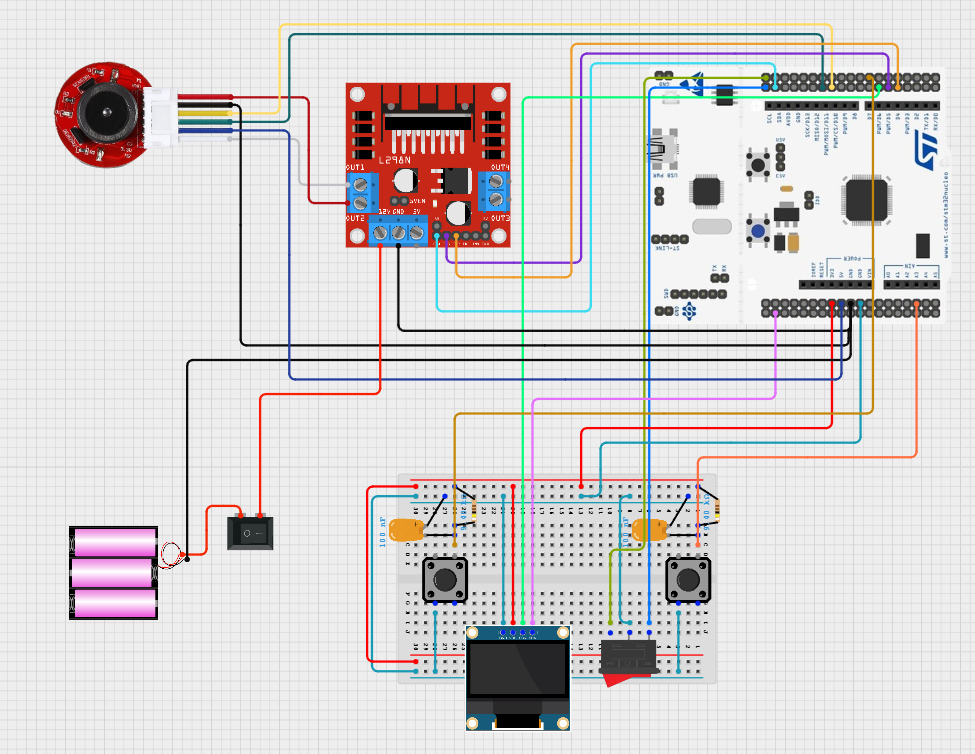

# 버튼 누름 시간 기반 DC 모터 속도 제어 및 로커 스위치 전/후진 전환 + OLED 상태 표시 기능 구현	

## 🎯 프로젝트 활용 방안
- 이 기능은 버튼 누름 시간에 따라 DC 모터의 속도를 정밀하게 제어하고, 로커 스위치를 통해 차량의 전진/후진 방향을 전환하며, OLED 디스플레이를 통해 현재 속도와 방향 상태를 실시간으로 시각화함으로써 
운전자 입력 기반의 직관적 주행 제어 시스템을 구현한다. 이는 RC카 프로젝트에서 운전자의 조작에 따른 속도 및 방향 제어를 가능하게 하고, 시각적 피드백을 통해 디버깅과 주행 안정성을 향상시키는 데 활용된다. 
---

## 📖 이론 개요

- 로커스위치로 전/후진 기어변속 구현
    - 3핀 로커스위치(토글 스위치)는 가운데 공통(COM) 핀과 양쪽 단자를 갖고 있어서 전진/후진 스위치로 적합함

### 로커 스위치 동작 원리

스위치가 FWD에 닿으면 PC9는 GND로 연결되어 LOW 입력 발생

스위치가 REV에 닿으면 PC8는 GND로 연결되어 LOW 입력 발생

### 로커 스위치 (폴링 방식 유리)
로커스위치는 구조적으로 천천히 누르거나 길게 눌리는 경우가 많고, 접점 떨림(bounce)이나 노이즈가 거의 없어 오작동 가능성이 낮으며, 상태가 고정되는 특성 때문에 전진(FWD) 또는 후진(REV)과 같은 지속적인 상태 입력에 적합하다. 이러한 이유로 빠른 응답이 필요한 인터럽트 방식보다는, 10~20ms 주기로 상태를 주기적으로 확인하는 폴링 방식이 구현이 간단하고 훨씬 안정적인 선택일 수 있다.

---

## 🔌 하드웨어 연결



|외부전원(5V)|L298N|F446RE보드|DC모터|
|:---:|:---:|:---:|:---:|
|+12V|+12v|||
|Gnd|Gnd|Gnd|encoder Gnd(black)|
||Out1||Motor-(white)|
||Out2||Motor+(red)|
||IN1|PB4||
||IN2|PB5||
||ENA|PB8||
|||+5v|encoder +5v(blue)|
|||PA7|encoder signal A(yellow)|
|||PA6|encoder signal B(green)|

|F446RE보드|택트 스위치|3핀 로커 스위치|OLED|
|:---:|:---:|:---:|:---:|
|PB0|Accel 버튼|||
|PB1|Brake 버튼|||
|PC12|||SDA|
|PB10|||SCL|
|Gnd|Gnd|Gnd(중앙,COM)|Gnd|
|+3.3V|||Vcc|
|PC8||우측||
|PC9||좌측핀||


- 택트 스위치는 외부 풀업 저항(9.4kΩ)에 연결되어 있으며,
눌렀을 때 LOW(0V) 상태가 되도록 연결
- HW 디바운싱 처리를 위해 0.1μF 커패시터 장착 
---  

## ⚙️ STM32CubeMX 설정

- GPIO
    - PB0, PB1: EXTI Interrupt (Rising and Falling edge)
    - 내부 풀업 저항 비활성화 (No pull-up and no pull-down)

- NVIC
    - EXTI line0 interrupt
    - EXTI line1 interrupt

- I2C
    - I2C2: SSD1306 연결 (400kHz : fast mode)
    - I2C2 - SCL PB10
    - I2C2 - SDA PC12

- TIM2
    - Prescaler: 89 -> 20ms로 맞춰주기위해 
    - Period: 19999+

- file 수정
    - fonts.h, ssd1306.h 내에서 stm32f4xx_hal.h로 수정
    - ssd1306.c 에서 extern I2C_HandleTypeDef hi2c2; 로 수정

> [이전 dc모터 ioc setting 참고](./Dc_Motor.md)
---
## 💻 코드 설명
동작요약 : 로커 스위치(PC8, PC9 입력 핀)의 상태를 20ms마다 폴링(polling)하여, 모터 드라이버의 IN1 / IN2 핀(GPIOB 4, 5)에 신호를 출력함으로써 DC 모터의 회전 방향(FWD/REV)을 전환

```c
if (now - prev_tick_main >= 20)  // 20ms마다 주기적으로 검사
{
    prev_tick_main = now;

    // 1) 방향 전환 스위치 처리
    if (HAL_GPIO_ReadPin(GPIOC, GPIO_PIN_8) == GPIO_PIN_RESET)  // PC8 == LOW → FWD
    {
        direction_switch = 0; // 상태 저장용
        HAL_GPIO_WritePin(GPIOB, GPIO_PIN_4, GPIO_PIN_RESET);  // IN1 = 0
        HAL_GPIO_WritePin(GPIOB, GPIO_PIN_5, GPIO_PIN_SET);    // IN2 = 1 → 정방향 회전
    }
    else if (HAL_GPIO_ReadPin(GPIOC, GPIO_PIN_9) == GPIO_PIN_RESET)  // PC9 == LOW → REV
    {
        direction_switch = 1;
        HAL_GPIO_WritePin(GPIOB, GPIO_PIN_4, GPIO_PIN_SET);  // IN1 = 1
        HAL_GPIO_WritePin(GPIOB, GPIO_PIN_5, GPIO_PIN_RESET);    // IN2 = 0 → 역방향 회전
    }
}
```

### 작동 원리

## 로커스위치 기반 방향 전환 작동 원리

|로커스위치 위치|PC8 상태|PC9 상태|IN1 (PB4)|IN2 (PB5)|모터 회전 방향|
|---------|----|--------|---------|--------|----------|
|전진 (FWD)|LOW|HIGH|0 (LOW)|1 (HIGH)|정방향 회전|
|후진 (REV)|HIGH|LOW|1 (HIGH)|0 (LOW)|역방향 회전|
|중립 (없음)|HIGH|HIGH|이전 상태 유지|이전 상태 유지|변화 없음|

- 로커스위치는 한 번 누르면 한 쪽으로 고정되어 LOW 상태가 지속되므로 폴링 방식이 적절함
- 둘 다 HIGH일 경우, 방향은 변경되지 않고 직전 설정 상태 유지된다.

### direction_switch 변수
```c
int direction_switch = 0; // 0: FWD, 1: REV
```
- 현재 방향 상태를 변수로 저장해두고 OLED 출력 등 다른 로직에서도 참조할 수 있게 함
- "DIR: %s" 출력 시 사용
```c
snprintf(buffer2, sizeof(buffer2), "DIR: %s", direction_switch == 0 ? "FWD" : "REV");
```

---

## ⚠️🛠️ 문제 해결 및 개선/확장

### 문제상황1.
로커스위치를 폴링 방식으로 처리하려 했으나, while 루프 내 코드가 동작하지 않음

- while (1) 루프가 정상적으로 실행되지 않고, 로커 스위치 입력도 무시되는 현상 발생
- 하드웨어 구성은 그대로 두고, 빈 프로젝트에서는 문제 없이 작동함
- HAL_TIM_Base_Start_IT(&htim2); 함수만 주석 처리하면 동작이 정상화됨 → 문제의 원인이 TIM2 인터럽트에 있음
- 분석 결과, HAL_TIM_PeriodElapsedCallback() 함수 내에서 SSD1306_UpdateScreen() 호출
    - 해당 함수는 내부적으로 HAL_I2C_Master_Transmit() (블로킹 방식 I2C API)을 사용
    - 그러나 I2C는 자체적으로도 인터럽트를 사용함
    - → ISR 안에서 블로킹 I2C 호출 시 데드락 발생
- 이로 인해 인터럽트에서 빠져나오지 못하고, main 루프에 진입하지 못함 → MCU 전체가 정지된 것처럼 보임
#### 해결 : 인터럽트에서는 OLED 업데이트를 하지 않고, 플래그 설정만 하도록 구조 변경
- HAL_TIM_PeriodElapsedCallback() 안에서는 디스플레이 갱신을 직접 수행하지 않음
- 대신 oled_update_flag = 1; 같은 플래그만 설정
- while(1) 루프 안에서 oled_update_flag가 설정되었을 때만 SSD1306_UpdateScreen() 호출
```c
// 타이머 인터럽트 내부
void HAL_TIM_PeriodElapsedCallback(TIM_HandleTypeDef *htim)
{
    if (htim->Instance == TIM2)
    {
        oled_update_flag = 1;  // 디스플레이 갱신 요청
    }
}

// 메인 루프
while (1)
{
    if (oled_update_flag)
    {
        oled_update_flag = 0;
        SSD1306_UpdateScreen();  // 여기서만 OLED 갱신
    }

    // 로커 스위치 폴링 등 다른 동작 수행
}
```

#### 💡 추가 팁
- 중요한 실시간 제어: 인터럽트 기반
- 부하가 크거나 통신 지연이 있는 작업: 메인 루프에서 플래그 기반 처리
- ISR에서는 블로킹 함수(I2C, UART, HAL_Delay 등) 절대 호출 금지

---

### 개선사항 1.
- CubeMX에서 Peripheral 별 파일 분할

#### 설정 방법
1. CubeMX 실행 후 .ioc 파일 열기
2. 상단 메뉴에서<br>
    Project Manager > Code Generator 탭 선택
3. Generate peripheral initialization as a pair of '.c/.h' files per peripheral   
4. 저장 후 GENERATE CODE 클릭

- 이 설정이 되어 있지 않으면 main.c 내부나 stm32f4xx_hal_msp.c 등에 모든 초기화 코드가 모이게 된다.

#### Peripheral 별 파일 분할의 장점
- 가독성 향상
    - 각 주변장치의 설정이 해당 전용 파일에 명확히 구분되므로, 코드를 파악하고 수정하기 쉬워짐
- 유지보수 용이
    - 예를 들어 I2C 설정만 바꾸고 싶을 때 i2c.c만 보면 되며, 다른 설정과 충돌하지 않도록 관리가 용이함
- 빌드 속도 개선
    - 변경이 발생한 .c 파일만 컴파일되므로, 프로젝트 규모가 클수록 빌드 시간 감소에 효과적임
- Git 버전관리 효율 
    - 기능별로 커밋이 가능하므로 이력 관리가 체계적으로 됨. (예: tim.c만 수정한 경우 diff 확인이 쉬움)
- 팀 협업에 유리
    - 여러 사람이 동시에 I2C, TIM 등 서로 다른 기능을 작업할 수 있어 충돌 가능성이 줄어들게 됨


---

## 💡 향후 확장 및 개선 아이디어

### RTOS 기반 확장 및 개선 아이디어
- OLED 제어 전용 Task 분리
- FreeRTOS 소프트웨어 타이머 활용
- 로커스위치 입력 감지 Task 분리
- Task 우선순위 기반 스케줄링 적용
- OLED 업데이트 최적화 (Dirty Flag 방식)
- RF 통신 Task 통합
- 멀티 Task 기반 시스템 구조 설계

 
