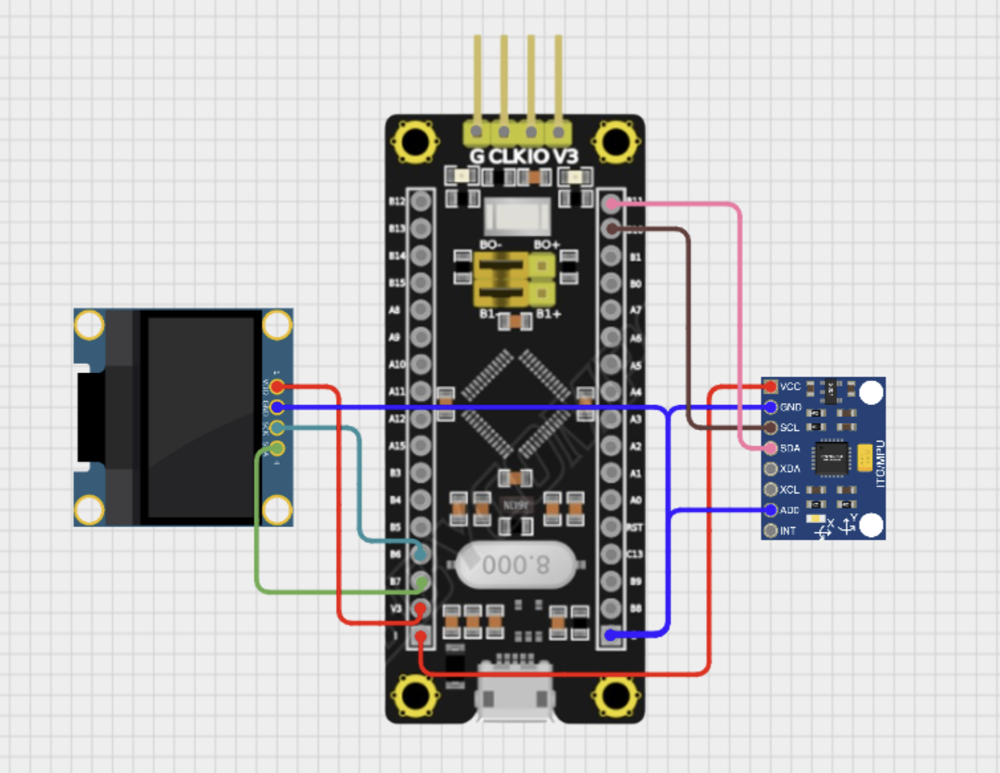

# [I2C OLED] 자이로센서 Roll 값 실시간 디스플레이

## 🎯 프로젝트 활용 방안
본 프로젝트는 RC카 핸들 제어를 위한 무선 컨트롤러에 자이로센서(MPU6050)를 장착하고, 차량의 회전 상태(Roll 각도)를 실시간으로 I2C 방식 OLED(SSD1306)에 시각적으로 출력하는 기능을 구현한다. 운전자의 직관적인 제어를 돕고, 자이로센서 데이터가 정상적으로 수신되고 있는지를 현장에서 즉시 확인하는 데 활용할 수 있다.

---

## 📖 이론 개요

### MPU6050 자이로센서 동작 원리
MPU6050은 3축 가속도계와 3축 자이로스코프가 통합된 6축 센서로, I2C 인터페이스를 통해 데이터를 송수신한다. 내부에 칼만 필터(Kalman filter)가 적용된 연산을 통해 자세(Roll, Pitch)를 비교적 안정적으로 계산할 수 있으며, 본 프로젝트에서는 Roll 각도만 추출하여 OLED에 출력한다.

### SSD1306 OLED 디스플레이 동작 원리
SSD1306은 128x64 해상도의 모노크롬 OLED 디스플레이로, SPI 또는 I2C로 MCU와 통신한다. 본 프로젝트에서는 I2C를 채택하여 데이터와 명령어를 전송하고, 그래픽 라이브러리(`fonts.h`, `ssd1306.h`)를 통해 텍스트를 출력한다.


---

## 🔌 하드웨어 연결



### 🔌 자이로센서(MPU6050) 연결

|센서 핀|STM32F103C8T6 핀|
|:---:|:---:|
|Vcc|3.3V|
|GND|GND|
|SDA|PB11 (I2C2_SDA)|
|SCL|PB10 (I2C2_SCL)|

---

### 🔌 OLED(SSD1306) 연결

|OLED 핀|STM32F103C8T6 핀|
|:---:|:---:|
|Vcc|3.3V|
|GND|GND|
|SDA|PB7 (I2C1_SDA)|
|SCL|PB6 (I2C1_SCL)|

- MPU6050과 OLED는 각각 I2C2, I2C1에 분리 연결

---

## ⚙️ STM32CubeMX 설정

### I2C
- `I2C1(OLED)` : Speed mode = 400kHz
- `I2C2(Gyro)` : Speed mode = 400kHz

### SYS
- Debug: Serial Wire 설정

### 기타
- OLED 라이브러리:  
 `fonts.h`, `ssd1306.h` -> Inc
 `fonts.c`,`ssd1306.c` -> Src

- MPU6050 라이브러리:   
`mpu6050.h` -> Inc  
`mpu6050.c` -> Src

> github 라이브러리 출처: https://github.com/leech001/MPU6050?tab=readme-ov-file
---

## 💻 코드 설명

동작 요약: I2C2를 통해 MPU6050의 roll 값을 읽고, I2C1을 통해 SSD1306 OLED에 1초 주기로 출력한다.

### main 루틴 핵심

```c
while (1)
{
    // 자이로센서 데이터 갱신
    MPU6050_Read_All(&hi2c2, &MPU6050);

    // Roll 각도 출력
    char buffer_roll[20];
    snprintf(buffer_roll, sizeof(buffer_roll), "Roll: %.2f", MPU6050.KalmanAngleX);
    SSD1306_GotoXY(0, 0);
    SSD1306_Puts(buffer_roll, &Font_11x18, 1);

    // 디스플레이 반영
    SSD1306_UpdateScreen();
    HAL_Delay(100);
}
```

## 📌 자이로센서 원시 데이터와 절대 각도 추정의 한계

### ✅ 자이로센서 원시 데이터란?

MPU6050 자이로센서는 3축의 회전 속도(각속도)를 측정하며, 그 값은 다음과 같은 변수로 저장됩니다:

- `Gyro_X_RAW`, `Gyro_Y_RAW`, `Gyro_Z_RAW`  
  → 각각 X, Y, Z 축의 **각속도(angular velocity)** 를 나타내며 단위는 일반적으로 **도/초 (deg/s)** 또는 **라디안/초 (rad/s)** 입니다.

예를 들어:

```c
Gx = Gyro_X_RAW / 131.0;  // FS_SEL = 0 설정 기준, 1 LSB = 131 deg/s
```

- 이 값은 **회전한 정도(각도)**가 아니라 **회전의 속도**, 즉 “얼마나 빠르게 회전하고 있는가”를 의미합니다.

---

### ⚠️ 자이로센서는 절대 각도를 직접 측정할 수 없다

- 자이로센서는 오직 **회전 속도의 변화량(각속도)** 만을 측정할 수 있습니다.
- 따라서 현재의 **절대 기울기(Roll, Pitch, Yaw)** 를 직접적으로 알 수 없습니다.

#### 📉 누적 적분 방식의 한계

각속도를 시간에 따라 적분하여 회전 각도를 유추할 수는 있으나, 다음과 같은 문제가 존재합니다:

| 문제 | 설명 |
|------|------|
| **드리프트(Drift)** | 아주 작은 오차도 시간이 지남에 따라 누적되어 심각한 각도 오차를 유발 |
| **초기 기준값 없음** | 절대 각도를 제공하지 않기 때문에 시작 각도가 불명확함 |

---

### 🧭 절대 각도 추정을 위한 센서 융합: 칼만 필터의 역할

이를 해결하기 위해 **가속도계 + 자이로센서**를 융합하고, **칼만 필터(Kalman Filter)** 를 적용하여 보다 정확한 절대 자세(Roll, Pitch)를 계산합니다.

#### 📌 가속도계 vs 자이로센서

| 센서 | 특징 | 장점 | 단점 |
|------|------|------|------|
| 가속도계 | 중력 방향 기준으로 기울기 계산 | 정적 상태에서 정확 | 움직임에 매우 민감 |
| 자이로센서 | 각속도 측정 | 움직임 추적에 강함 | 시간이 지날수록 오차 누적 |

#### ✅ 칼만 필터는?

- 두 센서의 장점을 융합하여 절대 각도를 실시간으로 추정
- 자이로센서의 빠른 반응성과 가속도계의 절대 기준 값을 조합
- 오차 공분산 행렬과 예측/보정 단계를 반복하며 최적의 상태 추정 수행

> 본 프로젝트에서는 roll 각도(`KalmanAngleX`) 계산 시, 칼만 필터를 통해 자이로센서 기반 누적값을 보정하고 있습니다.

---

### 📐 Roll 각도 계산 과정

MPU6050의 가속도계와 자이로스코프에서 읽은 원시 데이터를 기반으로, roll 각도를 계산하는 과정은 다음과 같다:

#### 1. 가속도계 기반 roll 각도 추정 (비선형 모델)

```c
double roll_sqrt = sqrt(Accel_X_RAW^2 + Accel_Z_RAW^2);
double roll = atan(Accel_Y_RAW / roll_sqrt) * RAD_TO_DEG;
```

- 수직 방향으로 중력 가속도를 기준으로, Y축의 기울기를 X축-Z축 평면 기준으로 아크탄젠트 연산
- `RAD_TO_DEG`는 라디안을 도(degree)로 변환하는 상수 (≈ 57.2958)

이 방식은 고정된 상태에선 정확하나 움직임이나 진동, 외란이 있을 경우 불안정함

#### 2. 자이로스코프 기반 회전 속도 추정

```c
Gx = Gyro_X_RAW / 131.0;
```

- MPU6050 자이로스코프의 출력은 16비트 정수로 되어 있으며, `FS_SEL = 0` 설정 시 1 LSB는 131 deg/sec에 해당
- 자이로는 순간적인 회전 속도를 측정하지만, 이를 시간 적분하여 각도로 변환하면 누적 오차가 발생

#### 3. 칼만 필터 기반 roll 추정

```c
KalmanAngleX = Kalman_getAngle(&KalmanX, roll, Gx, dt);
```

- 가속도계에서 계산한 `roll`과 자이로스코프의 회전속도 `Gx`를 칼만 필터에 입력
- 이전 상태를 기반으로 현재 상태를 추정하고, 두 센서의 장점을 결합하여 더 안정적인 roll 추정

---

### 🧮 Kalman Filter 내부 작동 방식

칼만 필터는 다음과 같은 수학적 절차로 구성된다:

#### 상태 변수
- `angle`: 추정 각도
- `bias`: 자이로스코프 바이어스 오차 추정
- `P[2][2]`: 오차 공분산 행렬

#### 주요 수식

```c
rate = newRate - bias;
angle += dt * rate;

P 업데이트...

K[0] = P[0][0] / S;
K[1] = P[1][0] / S;

angle += K[0] * (newAngle - angle);
bias  += K[1] * (newAngle - angle);

P 행렬 보정...
```

- **예측 단계 (Prediction)**: 자이로 데이터를 시간에 따라 누적하여 새로운 각도 예측
- **보정 단계 (Correction)**: 가속도계를 통해 측정한 각도와의 오차를 기반으로 예측값을 보정
- 오차 공분산 행렬 `P`를 갱신하면서 신뢰도에 따라 두 센서의 가중치를 자동 조절

---

### 📊 정리

| 센서 | 장점 | 단점 |
|------|------|------|
| 가속도계 | 절대 각도 기반 측정 가능 (중력 기준) | 노이즈에 민감, 동작 중 정확도 낮음 |
| 자이로스코프 | 빠른 동작에 강함, 순간 변화 민감 | 시간에 따라 드리프트(누적 오차) 발생 |
| 칼만 필터 | 두 센서의 장점을 결합하여 실시간 자세 추정 | 계산량이 많음, 구현 복잡도 ↑ |

---

### 🔧 관련 구조체 및 초기값

```c
Kalman_t KalmanX = {
    .Q_angle = 0.001f,
    .Q_bias = 0.003f,
    .R_measure = 0.03f
};
```

- `Q_angle`: 각도에 대한 프로세스 노이즈 공분산
- `Q_bias`: 바이어스 노이즈 공분산
- `R_measure`: 측정 노이즈 공분산
- 값이 작을수록 필터가 측정치보다는 예측치에 더 의존

> 칼만 필터 알고리즘 참고: https://github.com/TKJElectronics/KalmanFilter  
> 본 코드 기반: `mpu6050.c` (Author: Bulanov Konstantin, 2019)

---

## 💡 향후 확장 및 개선 아이디어

- **Yaw/Pitch 각도 병행 출력**  
  → Roll 외에도 Pitch 및 Yaw 각도를 함께 출력하여 3축 자세 정보 제공

- **UI 향상**  
  → Roll 값 기반 그래픽 표시(수평 막대, 방향 화살표 등) 적용하여 시인성 향상

- **무선 전송 연동**  
  → Roll 값을 NRF24L01 무선 송신 기능과 연동하여 차량 제어 MCU로 전송

- **FreeRTOS 적용**  
  → 센서 수집, OLED 출력, 무선 전송을 Task로 분리하여 안정적인 실시간 제어 구조 구축

- **센서 보정 기능 추가**  
  → Roll 값의 기준점(제로 레벨)을 전원 인가 시 또는 버튼 입력 시 기준으로 재설정

---
