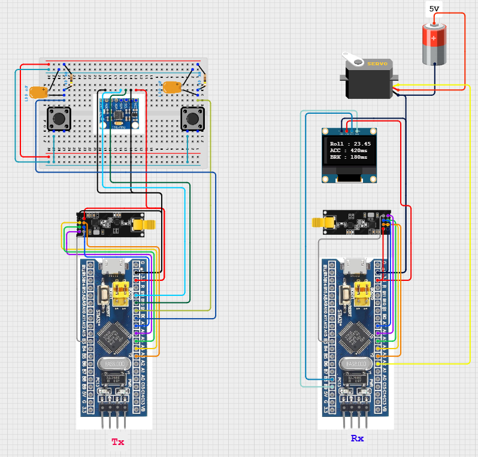

# RF 기반 자이로 핸들 입력 및 버튼 상태 송수신 시스템

## 🎯 프로젝트 활용 방안
본 프로젝트는 무선 핸들을 통해 RC카를 제어하는 시스템의 핵심 데이터인 **자이로센서 기반 roll 값**과 **악셀(acc), 브레이크(brk) 버튼의 눌림 시간**을 **NRF24L01+ RF 모듈**을 통해 송수신함으로써, RC카의 조향 및 가감속 제어를 가능하게 합니다. 송신부와 수신부 모두 STM32F103C8T6 MCU 기반이며, 이후 수신부는 STM32F446RE(M4 코어)로 전환할 예정입니다.

---

## 📖 이론 개요

### 관련 기술 개요

**NRF24L01+ 모듈**은 2.4GHz 주파수 대역에서 동작하는 **무선 송수신기**로, SPI(Serial Peripheral Interface)를 통해 MCU와 연결됩니다. 이 모듈은 **최대 10Mbps의 SPI 통신 속도**와 **1Mbps~2Mbps의 무선 전송률**을 지원하며, 저전력 고성능 무선 통신이 필요한 IoT, RC카, 센서 네트워크 등에 널리 사용됩니다.

### 핵심 동작 원리

1. **SPI 통신 흐름**  
   - MCU(Master)가 SCK(클럭), MOSI(데이터 출력), MISO(데이터 입력), CSN(슬레이브 선택) 핀을 통해 **NRF24L01+ 모듈(Slave)**과 **Full-duplex 방식**으로 통신합니다.
   - CSN 핀이 LOW가 되면 전송 개시, HIGH가 되면 종료됩니다.
   - 송신 시 CE 핀을 HIGH로 설정해 데이터를 무선으로 전송하고, 수신 시에는 CE를 계속 HIGH로 유지해 대기 모드로 둡니다.

2. **NRF24 RF 통신 절차**  
   - 송신부는 미리 설정된 파이프 주소와 채널을 기반으로 데이터를 전송합니다.
   - 수신부는 동일한 파이프 주소와 채널을 수신 대기 상태로 설정하여 일치하는 데이터만을 수신합니다.
   - 데이터 수신 시, IRQ 핀을 통해 인터럽트 신호를 발생시켜 MCU가 이를 감지할 수 있게 합니다.
   - Auto ACK 기능이 활성화되어 있으면 수신 성공 시 자동으로 송신부에 응답 신호가 전송됩니다.

- 이 프로젝트는 **MIT 라이선스를 따르는 [stm32_hal_nrf24_library](https://github.com/developer328/stm32_hal_nrf24_library)**를 사용하였으며, 다음 4개의 주요 파일로 구성됩니다:
  - `NRF24.c`
  - `NRF24.h`
  - `NRF24_conf.h`
  - `NRF24_reg_addresses.h`

---

## 🔌 하드웨어 연결



---

## ⚙️ STM32CubeMX 설정

### 📋 기본 설정 요약

#### 🌀 SPI1 설정
- **Mode**: Full-Duplex Master  
- **Prescaler**: 16 → 실제 Baud Rate: **4.5 Mbps**  
✅ NRF24L01+의 허용 SPI 속도는 최대 10Mbps

#### 📌 GPIO 핀 설정

| 기능   | 핀 번호 | 모드               | 설명                             |
|--------|---------|--------------------|----------------------------------|
| MISO   | PA6     | Alternate Function | SPI 수신                         |
| MOSI   | PA7     | Alternate Function | SPI 송신                         |
| SCK    | PA5     | Alternate Function | SPI 클럭                         |
| CSN    | PA3     | Output Push-Pull   | Maximum output speed → HIGH      |
| CE     | PA4     | Output Push-Pull   | Maximum output speed → HIGH      |
| IRQ    | PB3     | External Interrupt | EXTI3, Falling Edge 인터럽트     |

- **CSN/CE 핀은 NRF24 제어 신호로 사용되며**, 통신 안정성을 위해 `Output mode`와 함께 **최대 출력 속도(High speed)**로 설정해야 합니다. 낮은 속도에서는 SPI 클럭 타이밍에 비해 반응이 지연되어 통신 오류가 발생할 수 있습니다.
- **IRQ 핀은 Falling Edge로 설정**해야 NRF24L01+ 모듈이 내부 수신 버퍼에 데이터가 도착했을 때 **하강 에지 신호로 인터럽트를 발생**시킬 수 있습니다. Rising 또는 Level Trigger 방식은 NRF24의 하드웨어 동작 방식과 맞지 않아 인터럽트가 발생하지 않을 수 있습니다.

---

## 📶 전체 시스템 동작 흐름 요약

1. **송신부(STM32F103C8T6)**  
   - 자이로센서 MPU6050에서 roll 값을 읽고, 버튼 인터럽트를 통해 acc, brk 눌림 시간을 20ms 주기로 누적 측정  
   - int16_t, uint16_t, uint16_t 형식으로 패킹 후 20ms 간격으로 `nrf24_transmit()` 함수로 전송

2. **수신부(STM32F103C8T6)**  
   - EXTI3(PB3) 인터럽트를 통해 수신 이벤트 감지  
   - roll 값으로 서보모터 실시간 PWM 제어, 동시에 acc/brk, roll 값은 OLED에 디스플레이

> ⚠️ 실시간 무선 통신의 효율성과 MCU 연산 오버헤드를 고려하여, 부동소수점(float) 데이터를 직접 송신하는 방식은 배제하였습니다.  
> float을 무선 전송하려면 IEEE-754 형식으로 직렬화하고, 수신 후 다시 역직렬화(Deserialization)해야 하며, 이는 알고리즘 복잡도 및 코드 크기를 증가시키고 통신 오류 가능성도 높입니다.  
> 따라서 본 프로젝트에서는 `float`형 roll 값을 송신 전 `int16_t` 타입으로 100배 스케일링하여 정수로 변환한 뒤 전송하고, 수신 시 다시 나누어 복원하는 구조를 채택하였습니다.
---
## 🟩 송신부 동작 요약

### 🔧 초기화 절차

```c
  SSD1306_Init();
  while (MPU6050_Init(&hi2c2) == 1);
  HAL_TIM_Base_Start_IT(&htim2);

  csn_high();
  ce_high();
  HAL_Delay(5);
  ce_low();

  nrf24_init();
  nrf24_stop_listen();  // 송신기이므로 listen 비활성화

  nrf24_auto_ack_all(auto_ack);
  nrf24_en_ack_pld(disable);
  nrf24_dpl(disable);
  nrf24_set_crc(no_crc, _1byte);

  nrf24_tx_pwr(_0dbm);
  nrf24_data_rate(_1mbps);
  nrf24_set_channel(90);
  nrf24_set_addr_width(5);
  nrf24_set_rx_dpl(0, disable);
  nrf24_pipe_pld_size(0, PLD_S);
  nrf24_auto_retr_delay(4);
  nrf24_auto_retr_limit(10);

  nrf24_open_tx_pipe(tx_addr);
  ce_high();
```

- **roll 값 측정 및 변환**:  
  MPU6050 센서에서 읽어온 roll 각도 값(float)을 100배 스케일링하여 `int16_t`로 변환한 뒤 전송합니다.  
  이 방식은 `float`의 무선 전송 부담을 줄이기 위한 정수화 처리이며, 수신부에서는 다시 `float`으로 복원합니다.

```c
MPU6050_Read_All(&hi2c2, &MPU6050);
float roll = MPU6050.KalmanAngleX;
int16_t roll_encoded = (int16_t)(roll * 100.0f);
```

- **acc/brk 값**: 버튼이 눌린 시간(ms)을 20ms 단위로 측정하여 `uint16_t`로 전송
- **전송 주기**: `HAL_GetTick()` 기준 20ms 주기 송신
- **전송 데이터 구조** (`uint8_t dataT[32]`):
  - `dataT[0]`: 식별자 (`0x01`)
  - `dataT[1~2]`: roll (int16_t)
  - `dataT[3~4]`: acc 시간 (uint16_t)
  - `dataT[5~6]`: brk 시간 (uint16_t)

```c
dataT[0] = 1;
memcpy(&dataT[1], &roll_encoded, sizeof(int16_t));
memcpy(&dataT[3], &accel_ms, sizeof(uint16_t));
memcpy(&dataT[5], &brake_ms, sizeof(uint16_t));
nrf24_transmit(dataT, 32); 
```

> 🔁 이 구조는 송신부에서의 데이터 용량 최소화와 실시간 전송의 안정성을 동시에 만족시키며, 수신부에서는 `roll = (float)roll_encoded / 100.0f` 방식으로 원래 각도를 복원합니다.

---
## 🟩 수신부 동작 요약

### 🔧 초기화 절차

```c
SSD1306_Init();
HAL_TIM_PWM_Start(&htim2, TIM_CHANNEL_3);
HAL_TIM_Base_Start_IT(&htim2);

nrf24_init();
nrf24_stop_listen();
nrf24_auto_ack_all(auto_ack);
nrf24_en_ack_pld(disable);
nrf24_dpl(disable);
nrf24_set_crc(no_crc, _1byte);
nrf24_tx_pwr(_0dbm);
nrf24_data_rate(_1mbps);
nrf24_set_channel(90);
nrf24_set_addr_width(5);
nrf24_pipe_pld_size(0, 32);
nrf24_open_rx_pipe(0, rx_addr);
nrf24_listen();
```

### 📥 수신 로직

- EXTI3(PB3) 인터럽트 → `nrf24_data_available()` → `nrf24_receive()` 호출
- 데이터 해석 구조:
  - `rx_buffer[0]`: 식별자
  - `rx_buffer[1~2]`: roll (int16_t)
  - `rx_buffer[3~4]`: accel_ms (uint16_t)
  - `rx_buffer[5~6]`: brake_ms (uint16_t)

```c
if (rx_buffer[0] == 1) {
    memcpy(&roll_encoded, &rx_buffer[1], sizeof(int16_t));
    received_roll = ((float)roll_encoded) / 100.0f;

    memcpy(&received_accel_ms, &rx_buffer[3], sizeof(uint16_t));
    memcpy(&received_brake_ms, &rx_buffer[5], sizeof(uint16_t));

    new_data_flag = 1;
}
```

- OLED 출력 예시:

```
Roll: 23.45
ACC:  420ms
BRK:  180ms
```

- PWM 서보 제어:

```c
float angle = received_roll + 90.0f;
uint16_t pwm = 500 + (angle / 180.0f) * 2000.0f;
__HAL_TIM_SET_COMPARE(&htim2, TIM_CHANNEL_3, pwm);
```

> 🧭 `roll > 0` → 좌회전  
> 🧭 `roll < 0` → 우회전

---

## ⚠️🛠️ 문제 해결 및 개선/확장

### ✅ 개선 포인트

- `HAL_Delay()` 제거, `HAL_GetTick()` 기반 주기 처리 → non-blocking 구조
- 인터럽트 기반 수신 처리 → 실시간 반응성과 CPU 효율 개선

### 💡 향후 개선 아이디어

- 수신부를 STM32F446RE(M4)로 전환  
- RTC 및 외부 저장장치(SD 카드 등) 연동하여 조향 및 이벤트 로그 기록  
- RTOS Task 구조로 확장 가능

---

## 🔗 참고 링크

- [stm32_hal_nrf24_library (MIT License)](https://github.com/developer328/stm32_hal_nrf24_library)
