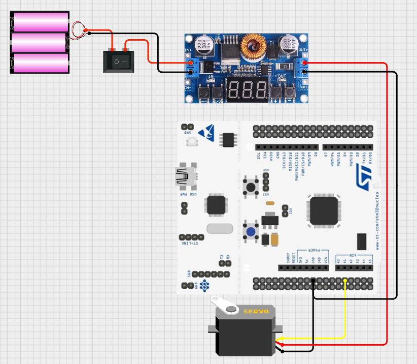

# [MG996R] 서보모터 동작 로직 구현

## 🎯 프로젝트 활용 방안
본 프로젝트에서 서보모터는 차량의 전륜 조향을 담당하며, 핸들에 부착된 자이로센서의 실시간 센싱 데이터를 기반으로 조향 각도를 제어한다.

---

## 📖 이론 개요

### MG996R 서보모터 동작원리

#### PWM 제어방식
- 신호주기 : 20ms (즉, 50Hz)
- 제어 방법 : duty cycle(PWM 펄스 폭)에 따라 서보 위치 제어
- 일반적으로 1.0ms(최소 각도), 1.5ms(중립), 2.0ms(최대 각도)의 펄스 폭에 따라 회전 각도가 결정된다.

> [MG996R datasheet](../datasheets/MG996R_datasheet.pdf)<br>
> 참고링크 : https://www.youtube.com/watch?v=HN9sKhKxy7M
---

## 🔌 하드웨어 연결



<br>
MG996R 서보모터는 안정적인 동작을 위해 4.8V~7.2V의 전압이 요구된다. 그러나 STM32 보드의 5V 핀은 전류 공급 능력이 500mA 이하로 제한되어 있어, 부하가 걸릴 경우 순간적으로 최대 2.5A까지 전류를 요구하는 MG996R에 충분한 전력을 공급하기 어렵다. 이에 따라, VCC와 GND는 배터리에서 스텝다운 컨버터를 통해 5V로 강압한 외부 전원에 연결하여 안정적인 전원 공급이 가능하도록 구성하였다.

<br>

|MG996R|외부 전원|F446RE 보드|
|:---:|:---:|:---:|
|Vcc|+5V|-|
||공통 Gnd||
|PWM|-|PA1|


---  

## ⚙️ STM32CubeMX 설정
board selector > f446re

clock configuration > HCLK 180MHz > APB1 90MHz<br>
> 내부 HSI 클럭(16MHz)을 PLL로 증폭하여 시스템 클럭을 180MHz로 설정<br>
APB1 = 45MHz → 타이머 클럭 = 90MHz (2배 보정)

Click Timer → Click TIM2 →

- Clock Source set to Internal Clock

- Channel2 set to PWM Generation CH2

Configuration → Parameter Settings →

- Prescaler set to 180-1 (APB1Timer*2-1)
- Counter Period : 10000-1

### 1. PWM 주기 계산
- 서보모터가 요구하는 PWM 주기(20ms)를 맞추기 위해 타이머 클럭과 Prescaler, Counter Period의 값을 조합하여 계산하며, 공식은 다음과 같다.
$$
PWM 주기 (T) = \frac{(Counter Period + 1) \times (Prescaler + 1)}{TimerClock(Hz)}
$$

#### 타이머 클럭(Hz) 계산 
- STM32F446RE의 기본 HCLK 기준 시스템 클럭 : 180MHz<br>
- TIM2는 APB1 타이머이므로, 기본적으로 2배 클럭 보정이 들어간다.
- APB1 Prescaler가 /4이기 때문에 
    - TIM2 클럭 = 180MHz /4 * 2 = 90MHz가 된다.

#### Timer tick 시간 계산
$$
Tick 시간 = \frac{1}{90MHz}\times {180MHz} = 2μs
$$
즉, 타이머 하나의 카운트가 2마이크로초(2μs)가 된다.

따라서 
$$
PWM 주기 (T) = \frac{(10000 -1 + 1) \times (180-1+1)}{90 ,000 ,000}=\frac{1,800,000}{90,000,000}=0.02sec = 20ms
$$

$$
= {(Counter Period + 1)}\times{Tick 시간} = 10,000 \times 2μs = 20ms
$$

### 2. PWM 주파수 계산
$$
주파수(f) = \frac{1}{주기(T)}=\frac{1}{20ms}=50Hz
$$

### 3. 펄스 폭(Pulse Width) 계산
펄스 폭(Pulse Width)은 PWM 신호에서 High 상태가 유지되는 시간을 의미하며, 이는 타이머의 설정 값(Prescaler, Period, Compare Value)에 따라 결정된다. PWM 출력에서 __HAL_TIM_SET_COMPARE() 함수로 설정하는 값은 타이머 카운트 기준의 Compare Match 값으로, 곧 High 상태가 유지되는 시간(카운트 수)을 나타내며, 다음과 같이 계산한다.

$$
펄스 폭(μs) = {Compare Value} \times 2
$$

### 4. 듀티비(Duty Cycle) 계산
듀티비란, PWM(펄스 폭 변조, Pulse Width Modulation) 신호에서 하나의 주기 동안 신호가 High 상태로 유지되는 비율을 뜻하며, 백분율(%)로 다음과 같이 계산한다.

$$
듀티 비(\%) = \frac{High상태시간}{전체주기시간} \times 100
$$

- 듀티비가 높다 -> High 상태가 더 길다 -> 서보가 더 많이 회전
- 듀티비가 낮다 -> High 상태가 짧다 -> 덜 회전

<br>
서보모터는 듀티비 자체보다는 펄스 폭(ms)을 해석하지만, 주기가 20ms로 고정된 상태에서는 펄스 폭과 듀티비가 직접 연결된다.<br>
ex) 1.5ms Pulse = 20ms 주기 -> 7.5% Duty Cycle

---
#### ▶️ 서보모터 PWM 듀티비 기반 조향 각도 매핑 구현 및 좌/우 조향 한계각 보정

## 💻 코드 설명
동작 요약 : 차량 섀시의 하드웨어 형태에 맞게 설정한 조향 한계값 범위 내에서 Compare 값(펄스 폭)을 변경하여 중립, 우회전, 좌회전 순서로 조향을 반복한다. 

### main 함수 동작 요약
```c
HAL_TIM_PWM_Start(&htim2, TIM_CHANNEL_2);  // TIM2 채널 2(PA1)에서 PWM 시작
```

```c
while (1)
{
  __HAL_TIM_SET_COMPARE(&htim2, TIM_CHANNEL_2, 750); // 1.5ms → 중립
  HAL_Delay(1000);
  
  __HAL_TIM_SET_COMPARE(&htim2, TIM_CHANNEL_2, 550); // 1.1ms → 우회전
  HAL_Delay(1000);
  
  __HAL_TIM_SET_COMPARE(&htim2, TIM_CHANNEL_2, 950); // 1.9ms → 좌회전
  HAL_Delay(1000);
}
```

- 차량 섀시에 닿지 않는 좌우 한계각 범위 내에서 서보모터를 제어하기 위해, Compare 값에 따른 펄스 폭을 계산한다. 

- Compare 값 × 2μs = 펄스 폭 관계를 기반으로, 펄스 폭 1.0ms~2.0ms 범위를 기준으로 할 때 중립 위치는 1.5ms에 해당하며, 이에 대응하는 Compare 값은 750이다. 

- 이 중립값을 기준으로 좌우 최대 한계각은 ±0.4ms 간격(즉, Compare ±200)을 적용하여 설정하고, 각 위치를 1초마다 반복적으로 전환하도록 구성한다.


> 참고링크<br>
: https://www.micropeta.com/video102<br>
: https://m.blog.naver.com/compass1111/221163124212<br>
: https://m.blog.naver.com/emperonics/221725399383<br>
<br>
> 커밋 해시 : [5a98f15](https://github.com/YeonsuJ/Car_control_project/commit/5a98f15fcaf7b8b2b6cbc164c3750759f83637fc)


---


## ⚠️🛠️ 문제 해결 및 개선/확장

### 문제상황 1.
전원을 공급할 때마다 배터리를 홀더에서 탈부착해야 하는 번거로움이 있었다.  <br>
**해결** : 회로의 기준점(Gnd)을 항상 유지하면서 전체 회로에 안전하게 전원을 차단할 수 있도록 + 쪽의 전선 중간에 로커 스위치(정격 3A 250V AC)를 추가하였다. 

---

## 💡 향후 확장 및 개선 아이디어
- 자이로센싱 값 기반 서보모터 조향 로직 통합
- 오실로스코프 PWM 파형 시각화


