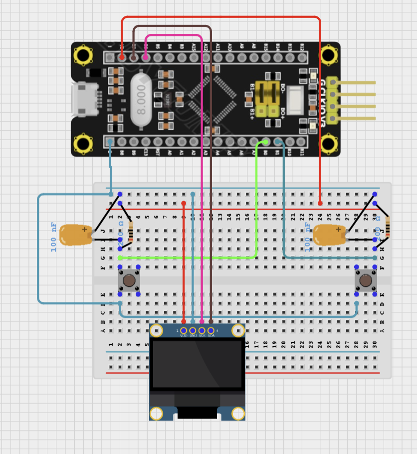

# [타이머 인터럽트 기반] 버튼 눌림 시간 측정 및 OLED 출력

## 🎯 프로젝트 개요

본 프로젝트는 STM32F103C8T6 보드에서 **외부 인터럽트와 타이머 인터럽트**를 이용하여 두 개의 버튼 입력 시간(가속/브레이크)을 측정하고, 이를 **I2C 기반 OLED(SSD1306)** 화면에 실시간으로 출력하는 시스템을 구현합니다.  
이를 통해 사용자의 입력 지속 시간(Press Duration)을 시각적으로 모니터링할 수 있으며, 차량 제어 입력 분석, 디버깅, UI 피드백 등에 활용할 수 있습니다.

---

## 📖 이론 개요

### ⏱️ 버튼 입력 시간 측정 원리

1. **외부 인터럽트 (EXTI)**
   - 버튼 핀(PB0: Accel, PB1: Brake)에 입력 변화가 감지되면 인터럽트 발생
   - **GPIO_PIN_RESET → 눌림**, **GPIO_PIN_SET → 떼짐**
   - 눌림이 감지되면 `pressed` 플래그를 `1`로 설정하고, 카운트 초기화
   - 떼짐이 감지되면 `pressed` 플래그를 `0`으로 설정

2. **타이머 인터럽트 (TIM2)**
   - 20ms 주기로 반복 발생
   - 버튼이 눌려 있는 동안 카운트를 증가시킴 (`count++`)
   - 누적된 카운트를 `count * 20`으로 변환하여 **ms 단위 시간** 계산

3. **OLED 출력**
   - OLED에 버튼 이름과 함께 누적 시간(예: ACC: 240ms) 출력

---

## 🔌 하드웨어 연결



| 기능       | STM32 핀       | 연결 대상    |
|------------|----------------|--------------|
| Accel 버튼 | PB0            | 택트 스위치  |
| Brake 버튼 | PB1            | 택트 스위치  |
| OLED SDA   | PB7 (I2C1_SDA) | SSD1306      |
| OLED SCL   | PB6 (I2C1_SCL) | SSD1306      |

> 버튼은 외부 풀업 저항에 연결되어 있으며,  
눌렀을 때 `LOW`(0V) 상태가 되도록 연결  
0.1μF 커패시터 장착 (HW 디바운싱 처리)
---

## ⚙️ STM32CubeMX 설정 요약

### GPIO
- PB0, PB1: EXTI Interrupt (Rising and Falling edge)
- 내부 풀업 저항 비활성화

### I2C
- I2C1: SSD1306 연결 (400kHz)

### TIM2
- Prescaler: 71
- Period: 19999

---

## 💻 주요 코드 설명

### 외부 인터럽트 핸들러 (HAL_GPIO_EXTI_Callback)

```c
void HAL_GPIO_EXTI_Callback(uint16_t GPIO_Pin)
{
    uint32_t now = HAL_GetTick();

    if (GPIO_Pin == GPIO_PIN_0)  // Accel 버튼
    {
        if (HAL_GPIO_ReadPin(GPIOB, GPIO_PIN_0) == GPIO_PIN_RESET) {
            accel_pressed = 1;
            accel_count = 0;
            prev_tick_accel = now;
        } else {
            accel_pressed = 0;
            prev_tick_accel = now;
        }
    }
    else if (GPIO_Pin == GPIO_PIN_1)  // Brake 버튼
    {
        if (HAL_GPIO_ReadPin(GPIOB, GPIO_PIN_1) == GPIO_PIN_RESET) {
            brake_pressed = 1;
            brake_count = 0;
            prev_tick_brake = now;
        } else {
            brake_pressed = 0;
            prev_tick_brake = now;
        }
    }
}
```

### 타이머 인터럽트 핸들러 (HAL_TIM_PeriodElapsedCallback)

```c
void HAL_TIM_PeriodElapsedCallback(TIM_HandleTypeDef *htim)
{
    if (htim->Instance == TIM2)
    {
        if (accel_pressed) accel_count++;
        if (brake_pressed) brake_count++;

        char buffer1[20], buffer2[20];

        snprintf(buffer1, sizeof(buffer1), "ACC: %lums", accel_count * 20);
        SSD1306_GotoXY(0, 0);
        SSD1306_Puts(buffer1, &Font_11x18, 1);

        snprintf(buffer2, sizeof(buffer2), "BRK: %lums", brake_count * 20);
        SSD1306_GotoXY(0, 20);
        SSD1306_Puts(buffer2, &Font_11x18, 1);

        SSD1306_UpdateScreen();
    }
}
```
# 코드 스크립트용
```
  /* USER CODE BEGIN 2 */
  SSD1306_Init();
    HAL_TIM_Base_Start_IT(&htim2);
  /* USER CODE END 2 */

/* USER CODE BEGIN 4 */
void HAL_GPIO_EXTI_Callback(uint16_t GPIO_Pin)
{
    uint32_t now = HAL_GetTick();

    if (GPIO_Pin == GPIO_PIN_0)  // Accel 버튼
    {
        if (HAL_GPIO_ReadPin(GPIOB, GPIO_PIN_0) == GPIO_PIN_RESET)
        {
            // 눌림이 감지된 순간(하강), 디바운싱 여부와 상관없이 초기화
            accel_pressed = 1;
            accel_count = 0;
            prev_tick_accel = now;
        }
        else
        {
            // 떼짐(상승)은 즉시 pressed=0 처리
            accel_pressed = 0;
            prev_tick_accel = now;
        }
    }
    else if (GPIO_Pin == GPIO_PIN_1)  // Brake 버튼
    {
        if (HAL_GPIO_ReadPin(GPIOB, GPIO_PIN_1) == GPIO_PIN_RESET)
        {
            // 눌림이 감지된 순간(하강), 디바운싱 여부와 상관없이 초기화
            brake_pressed = 1;
            brake_count = 0;
            prev_tick_brake = now;
        }
        else
        {
            // 떼짐(상승)은 즉시 pressed=0 처리
            brake_pressed = 0;
            prev_tick_brake = now;
        }
    }
}

void HAL_TIM_PeriodElapsedCallback(TIM_HandleTypeDef *htim)
{
    if (htim->Instance == TIM2) // 20ms 주기 타이머
    {
        if (accel_pressed) accel_count++;
        if (brake_pressed) brake_count++;

        char buffer1[20], buffer2[20];

        snprintf(buffer1, sizeof(buffer1), "ACC: %lums", accel_count * 20);
        SSD1306_GotoXY(0, 0);
        SSD1306_Puts(buffer1, &Font_11x18, 1);

        snprintf(buffer2, sizeof(buffer2), "BRK: %lums", brake_count * 20);
        SSD1306_GotoXY(0, 20);
        SSD1306_Puts(buffer2, &Font_11x18, 1);

        SSD1306_UpdateScreen();
    }
/* USER CODE END 4 */
```


---

## 📌 요약 흐름도

1. **버튼 누름** → EXTI 인터럽트 발생 → `pressed = 1`, `count = 0`
2. **버튼 유지** → TIM2 인터럽트 20ms마다 `count++`
3. **버튼 뗌** → EXTI 인터럽트로 `pressed = 0` 설정
4. OLED에 측정된 시간(`count * 20ms`) 표시

---

## 💡 확장 아이디어

- 버튼 누름 시간에 따라 모터 제어
- OLED 그래픽 막대(Progress Bar)로 시각화
- FreeRTOS 적용 시 Task로 측정 로직 분리
- 무선 통신 모듈 연동 시 누름 시간 전송

---
