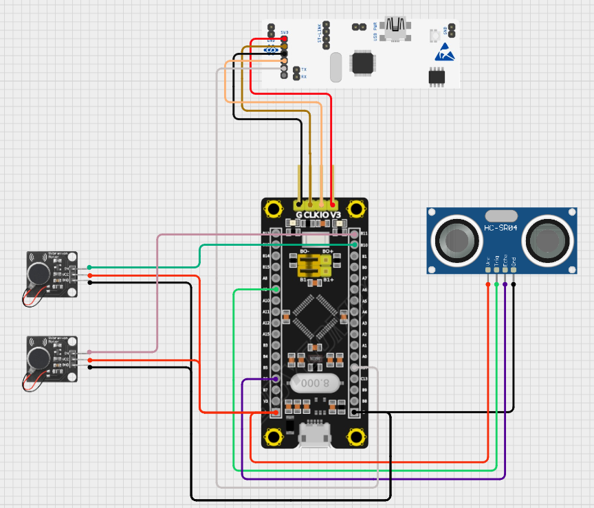

# 초음파센서 거리값 기반 진동모터 햅틱 발생 로직 구현	

## 🎯 프로젝트 활용 방안
초음파 센서로 감지한 거리값을 기반으로, 일정 거리 이내 접근 시 진동모터를 작동시켜 운전자에게 직관적인 햅틱 경고를 제공함으로써 RC카의 충돌 방지 및 사용자 반응성을 향상시킴

---

## 📖 이론 개요

### 트랜지스터 내장형 진동 모터 모듈
이 모듈은 S8050 NPN 트랜지스터를 내장하고 있으며, MCU 제어 신호로 진동 모터를 스위칭 구동하는 역할을 한다.

#### 진동 모터 모듈에서 트랜지스터의 역할
1. 신호 증폭
MCU의 디지털 출력은 수 mA 수준으로, 직접 모터를 구동하기엔 부족하기 때문에 내장된 트랜지스터가 이를 증폭하여 모터에 필요한 전류(최대 60~90mA)를 공급한다.

2. 전류 스위치 (Low-side Switching)
MCU에서 IN 핀에 HIGH 신호가 들어오면, 트랜지스터 베이스가 활성화되어
모터의 GND 경로가 열리며 모터가 진동하게 된다.

> [Vibration Motor Module datasheet](../datasheets/Vibration_Motor_Module_datasheet.pdf)

---

## 🔌 하드웨어 연결



|F103보드|진동모터A,B|
|:---:|:---:|
|PB10|IN(모터A)|||
|PB11|IN(모터B)|||
|공통 GND|
|+5V|VCC(A,B)|

|F103보드|초음파센서|
|:---:|:---:|
|PA9|Trig|
|PB6|Echo|
|공통 GND|
|+5V|VCC|

---  

## ⚙️ STM32CubeMX 설정

### 진동모터

- PB10 : GPIO_Output
- PB11 : GPIO_Output

> [이전 초음파센서 ioc setting 참고](./Ultrasonic.md)
---
## 💻 코드 설명
동작요약 : HAL_GetTick() 기반으로 100ms 주기로 초음파 센서를 트리거하고, 거리값(distance)이 10cm 이하일 때 진동 모터 2개를 동작시킴

```c
// 마지막으로 초음파 센서를 트리거한 시간(ms)을 저장하는 변수
uint32_t prev_tick = 0; 

while (1)
{
    // 현재 시간과 이전 시간 차이가 100ms 이상일 경우, 즉 0.1초 주기로 초음파 센서 트리거 및 모터 상태 갱신을 수행
    if (HAL_GetTick() - prev_tick >= 100)
    {
        prev_tick = HAL_GetTick();

        // 1) 초음파 센서의 Trig 핀에 10us 펄스를 줘서 거리 측정을 시작
        HAL_GPIO_WritePin(TRIG_PORT, TRIG_PIN, GPIO_PIN_SET);
        delay_us(10);
        HAL_GPIO_WritePin(TRIG_PORT, TRIG_PIN, GPIO_PIN_RESET);

        // 2) 거리값에 따른 진동 모터 제어
        if (distance <= 10 && distance > 0)
        {
            HAL_GPIO_WritePin(GPIOB, GPIO_PIN_10, GPIO_PIN_SET); // 모터A ON
            HAL_GPIO_WritePin(GPIOB, GPIO_PIN_11, GPIO_PIN_SET); // 모터B ON
        }
        else
        {
            HAL_GPIO_WritePin(GPIOB, GPIO_PIN_10, GPIO_PIN_RESET); // 모터A OFF
            HAL_GPIO_WritePin(GPIOB, GPIO_PIN_11, GPIO_PIN_RESET); // 모터B OFF
		}
	}
}
```

---

## ⚠️🛠️ 문제 해결 및 개선/확장

### 개선사항 
- HAL_Delay() 대신 HAL_GetTick() 기반으로 초음파 센서 측정 주기를 제어하도록 변경
- 기존 코드에서는 초음파 센서의 거리 측정을 위해 HAL_Delay(100) 함수를 사용하여 100ms의 고정 지연을 발생시켰음. 그러나 HAL_Delay()는 해당 시간 동안 CPU가 완전히 blocking되므로, 다른 작업을 동시에 수행할 수 없고, 향후 FreeRTOS와 같은 RTOS 환경 도입 시 충돌 위험이 존재함.

### 개선내용 
- HAL_GetTick() 함수는 시스템 시작 이후 경과된 시간을 ms 단위로 반환하는 비차단형 타이머 함수이며, 이를 이용해 측정 주기를 제어한다.

### 기대 효과
- 측정 주기의 정확도 향상 (밀리초 단위까지 정밀 제어)
- 메인 루프의 유연성 확보 (다른 기능과 병렬 처리 가능)
- RTOS 전환 시 유리한 구조 (Non-blocking 코드 → Task 기반 구조로 쉽게 포팅 가능)

---

## 💡 향후 확장 및 개선 아이디어
- PWM 활용
    - 1. 충돌감지 거리 설정값 이하 근접 > 듀티비 50% 햅틱 발생<br>
    - 2. 충돌감지센서(향후 추가) 동작(차량이 물리적으로 충돌한 경우) > 듀티비 100% 햅틱 발생 (몇초간)
- RTC와 결합하여 충격 발생 시각 기록
    - SD카드나 외부 플래시에 저장 ("Crash @ 12:45:21, 강도: High" 등). 
- 구조를 RTOS task 기반으로 리팩토링


 