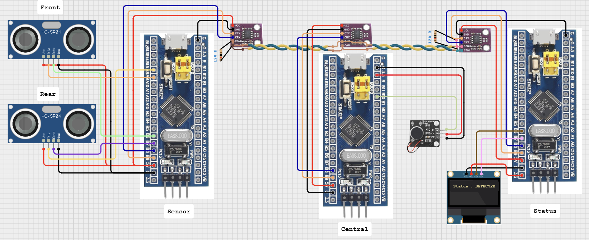

#  Broadcast 기반 CAN 송/수신 초음파센서 -> 햅틱센서 제어 통합 (v1.5.0)

## 📝 동작 요약
센서부는 초음파 센서로 측정한 거리값을 기반으로, 장애물 감지 여부에 따라 1 또는 0의 상태 데이터를 생성하고, 이를 CAN ID 0x6A5로 브로드캐스트 전송한다. 이 메시지는 동일한 ID를 수신 필터로 설정한 모든 CAN 노드에서 동시에 수신되며, 각 노드는 수신된 데이터를 기반으로 고유한 역할을 수행하게 된다.

상태부(car_status) 수신 노드는 OLED 디스플레이에 감지 상태를 텍스트로 출력한다:

- 0 수신 시: "SAFE" (감지되지 않음)
- 1 수신 시: "DETECTED" (장애물 감지됨)

중앙제어부(car_central) 수신 노드는 햅틱 센서를 통해 진동 피드백을 제공하며, 1 수신 시에만 진동 모터가 작동된다.

이와 같이, 하나의 CAN 메시지를 기반으로 여러 노드가 각기 다른 방식으로 반응하는 브로드캐스트 기반 분산 제어 구조를 구성한다.

### Broadcast 방식이란?
CAN 통신에서 하나의 송신 노드가 특정 ID로 전송한 메시지를 다수의 수신 노드가 동시에 수신하는 구조를 브로드캐스트(Broadcast) 방식이라고 한다. 이는 CAN의 메시지 ID 기반 필터링 구조를 활용한 전형적인 설계라고 할 수 있다.

#### 작동 방식

|송신노드|수신노드1|수신노드2|전송ID|효과|
|:---:|:---:|:---:|:---:|:---:|
|Sensor|Status|Central|0x6A5|모든 노드가 수신가능|

- 수신 노드는 CAN 필터를 동일한 ID(0x6A5) 로 설정함으로써 동일 메시지를 동시에 수신할 수 있다.
- 메시지 구조는 같더라도 수신 노드의 역할에 따라 해석 및 처리 방식이 달라질 수 있다.

#### 장점
- 동기화 유지: 동일한 정보로 여러 장치가 동시에 반응 가능
- 통신 효율적: 동일 메시지 1회 전송으로 다수 노드 동작 가능
- 확장 용이: 새 노드 추가 시 필터 설정만으로 간단히 참여 가능

#### 주의점
- 모든 수신 노드가 같은 ID를 받기 때문에, 각 수신 측에서 수신 데이터를 자체 판단해 선택적으로 처리해야 함
    - ex: RxData[0] 값이 1일 때만 동작
- 만약 각 노드가 서로 다른 데이터를 수신해야 한다면, 송신 ID를 분리해야 함
    - ex: 0x6A1 → Slave1 전용, 0x6A2 → Slave2 전용
---

## 🔌 하드웨어 연결



---

## ⚙️ STM32CubeMX 설정

### 송신노드 ioc 설정

- CAN
    - can > activated
    - parameter settings
        - prescaler : 72
        - time qunta bs 1 : 2times
        - time qunta bs 2 : 1times
        -> 125000 bit/s

- TIM <br> 
    `초음파센서(전방)`
    - Tim4_ch1 -> Input Capture direct mode 
    - TIM4 global interrupt
    - parameter settings
        - prescaler : 72-1
        - counter period : 65535(0xffff)

    `초음파센서(후방)`
    - Tim4_ch2 -> Input Capture direct mode
    - TIM4 global interrupt
    - parameter settings
        - prescaler : 72-1
        - counter period : 65535(0xffff)

    `Delay 함수용 Timer 추가`
    - TIM2 > Mode: Internal Clock
    - parameter settings
        - prescaler : 72-1
        - counter period : 65535  
    
- GPIO
    - pb9 : can_tx
    - pb8 : can_rx
    - pb6 : Front_Echo (tim4_ch1)
    - pb7 : Rear_Echo (tim4_ch2)
    - pa9 : Front_Trig (gpio_output)
    - pa8 : Rear_Trig (gpio_output)
    - TIM2는 delay용이므로 아무 핀도 할당하지 않아도 됨

### 수신노드(Status) ioc 설정

- CAN
    - can > activated
    - parameter settings
        - prescaler : 72
        - time qunta bs 1 : 2times
        - time qunta bs 2 : 1times
        -> 125000 bit/s
- NVIC
    - CAN RX1 interrupt
- I2C1
    - Fast Mode (400k)
- GPIO
    - pb9 : can_tx
    - pb8 : can_rx
    - pb7 : i2c1_sda (OLED_SDA)
    - pb6 : i2c1_scl (OLED_SCL)

 
### 수신노드(Central) ioc 설정

- CAN
    - can > activated
    - parameter settings
        - prescaler : 72
        - time qunta bs 1 : 2times
        - time qunta bs 2 : 1times
        -> 125000 bit/s
- NVIC
    - CAN RX1 interrupt
- GPIO
    - pb9 : can_tx
    - pb8 : can_rx
    - pb10 : Haptic_In (gpio_output)

---

## 💻 코드 주요 로직
### 송신노드(Sensor)
-> distance front 또는 rear의 값이 10이하인 경우 CAN bus에 1을 지속적으로 송신
```c
while (1)
  {
	  // 20ms 주기 체크
	  if (HAL_GetTick() - prev_tick >= 100)
	  {
		  prev_tick = HAL_GetTick();

		  // 1) 전방 트리거 (PA9)
		  HAL_GPIO_WritePin(FRONT_TRIG_PORT, FRONT_TRIG_PIN, GPIO_PIN_SET);
		  delay_us(10);
		  HAL_GPIO_WritePin(FRONT_TRIG_PORT, FRONT_TRIG_PIN, GPIO_PIN_RESET);

		  // 2) 후방 트리거 (PA8)
		  HAL_GPIO_WritePin(REAR_TRIG_PORT, REAR_TRIG_PIN, GPIO_PIN_SET);
		  delay_us(10);
		  HAL_GPIO_WritePin(REAR_TRIG_PORT, REAR_TRIG_PIN, GPIO_PIN_RESET);

		  // 3) 거리 조건 확인 후 CAN 데이터 설정
		  if (distance_front <= 10 || distance_rear <= 10)
			TxData[0] = 1;
		  else
			TxData[0] = 0;

		  // 4) CAN 메시지 전송
		  HAL_CAN_AddTxMessage(&hcan, &TxHeader, TxData, &TxMailbox);
	  }
  }
```
```c
void delay_us(uint16_t us)
{
  __HAL_TIM_SET_COUNTER(&htim2, 0);
  while (__HAL_TIM_GET_COUNTER(&htim2) < us);
}
```
```c
void HAL_TIM_IC_CaptureCallback(TIM_HandleTypeDef *htim)
{
  if (htim->Instance == TIM4)
  {
    if (htim->Channel == HAL_TIM_ACTIVE_CHANNEL_1)  // 전방 Echo
    {
      if (is_first_captured_front == 0)
      {
        ic_val1_front = HAL_TIM_ReadCapturedValue(htim, TIM_CHANNEL_1);
        __HAL_TIM_SET_CAPTUREPOLARITY(htim, TIM_CHANNEL_1, TIM_INPUTCHANNELPOLARITY_FALLING);
        is_first_captured_front = 1;
      }
      else
      {
        ic_val2_front = HAL_TIM_ReadCapturedValue(htim, TIM_CHANNEL_1);
        __HAL_TIM_SET_CAPTUREPOLARITY(htim, TIM_CHANNEL_1, TIM_INPUTCHANNELPOLARITY_RISING);
        __HAL_TIM_DISABLE_IT(htim, TIM_IT_CC1);
        uint32_t diff = (ic_val2_front > ic_val1_front) ? (ic_val2_front - ic_val1_front) : (0xFFFF - ic_val1_front + ic_val2_front);
        distance_front = (diff * 0.0343f) / 2.0f;
        is_first_captured_front = 0;
        __HAL_TIM_ENABLE_IT(htim, TIM_IT_CC1);
      }
    }

    else if (htim->Channel == HAL_TIM_ACTIVE_CHANNEL_2)  // 후방 Echo
    {
      if (is_first_captured_rear == 0)
      {
        ic_val1_rear = HAL_TIM_ReadCapturedValue(htim, TIM_CHANNEL_2);
        __HAL_TIM_SET_CAPTUREPOLARITY(htim, TIM_CHANNEL_2, TIM_INPUTCHANNELPOLARITY_FALLING);
        is_first_captured_rear = 1;
      }
      else
      {
        ic_val2_rear = HAL_TIM_ReadCapturedValue(htim, TIM_CHANNEL_2);
        __HAL_TIM_SET_CAPTUREPOLARITY(htim, TIM_CHANNEL_2, TIM_INPUTCHANNELPOLARITY_RISING);
        __HAL_TIM_DISABLE_IT(htim, TIM_IT_CC2);
        uint32_t diff = (ic_val2_rear > ic_val1_rear) ? (ic_val2_rear - ic_val1_rear) : (0xFFFF - ic_val1_rear + ic_val2_rear);
        distance_rear = (diff * 0.0343f) / 2.0f;
        is_first_captured_rear = 0;
        __HAL_TIM_ENABLE_IT(htim, TIM_IT_CC2);
      }
    }
  }
}
```

### 수신노드(Status)
-> 수신받은 데이터(1 or 0)에 따라 OLED 디스플레이
```c
// can 필터 설정 및 인터럽트 활성화 함수
void CAN_Filter_Config(void)
{
	// Configure the filter
	sFilterConfig.FilterActivation = CAN_FILTER_ENABLE;
	sFilterConfig.FilterFIFOAssignment = CAN_FILTER_FIFO1;
	sFilterConfig.FilterMode = CAN_FILTERMODE_IDMASK;
	sFilterConfig.FilterIdHigh = 0x6A5<<5;
	sFilterConfig.FilterIdLow = 0;
	sFilterConfig.FilterMaskIdHigh = 0x7FF<<5; // SET 0 to unfilter
	sFilterConfig.FilterMaskIdLow = 0;
	sFilterConfig.FilterScale = CAN_FILTERSCALE_32BIT;

	if (HAL_CAN_ConfigFilter(&hcan, &sFilterConfig) != HAL_OK)
	        Error_Handler(); // 실패 시 무한 루프 등 처리

	// Activate the notification
	if (HAL_CAN_ActivateNotification(&hcan, CAN_IT_RX_FIFO1_MSG_PENDING) != HAL_OK)
	        Error_Handler(); // 실패 시 처리
}
```
```c
// CAN 수신 인터럽트 콜백 함수 (FIFO1)
void HAL_CAN_RxFifo1MsgPendingCallback(CAN_HandleTypeDef *hcan)
{
    HAL_CAN_GetRxMessage(hcan, CAN_RX_FIFO1, &RxHeader, RxData);

    SSD1306_Clear();  // 이전 화면 클리어

    if (RxData[0] == 1)
    {
        SSD1306_GotoXY(0, 0);
        SSD1306_Puts("Status: DETECTED", &Font_7x10, 1);
    }
    else if (RxData[0] == 0)
    {
        SSD1306_GotoXY(0, 0);
        SSD1306_Puts("Status: SAFE", &Font_7x10, 1);
    }
    else
    {
        SSD1306_GotoXY(0, 0);
        SSD1306_Puts("Status: UNKNOWN", &Font_7x10, 1);
    }

    SSD1306_UpdateScreen();  // 화면에 반영
}
```
### 수신노드(Central)

```c
// can 필터 설정 및 인터럽트 활성화 함수
void CAN_Filter_Config(void)
{
   // Configure the filter
   sFilterConfig.FilterActivation = CAN_FILTER_ENABLE;
   sFilterConfig.FilterFIFOAssignment = CAN_FILTER_FIFO1;
   sFilterConfig.FilterMode = CAN_FILTERMODE_IDMASK;
   sFilterConfig.FilterIdHigh = 0x6A5<<5;
   sFilterConfig.FilterIdLow = 0;
   sFilterConfig.FilterMaskIdHigh = 0x7FF<<5; // SET 0 to unfilter
   sFilterConfig.FilterMaskIdLow = 0;
   sFilterConfig.FilterScale = CAN_FILTERSCALE_32BIT;

   if (HAL_CAN_ConfigFilter(&hcan, &sFilterConfig) != HAL_OK)
           Error_Handler(); // 실패 시 무한 루프 등 처리

   // Activate the notification
   if (HAL_CAN_ActivateNotification(&hcan, CAN_IT_RX_FIFO1_MSG_PENDING) != HAL_OK)
           Error_Handler(); // 실패 시 처리
}
```
```c
// CAN 수신 인터럽트 콜백 함수 (FIFO1)
void HAL_CAN_RxFifo1MsgPendingCallback(CAN_HandleTypeDef *hcan)
{
  HAL_CAN_GetRxMessage(hcan, CAN_RX_FIFO1, &RxHeader, RxData);

  // 1. 햅틱 모터는 즉시 제어
  if (RxData[0] == 1)
    HAL_GPIO_WritePin(GPIOB, GPIO_PIN_10, GPIO_PIN_SET);
  else
    HAL_GPIO_WritePin(GPIOB, GPIO_PIN_10, GPIO_PIN_RESET);
}
```
---

## 💡 향후 확장 및 개선 아이디어
- FreeRTOS 기반 CAN 통신 모듈화 및 태스크 분리
- 고속CAN 통신을 위해 buad rate 500k로 상향 
