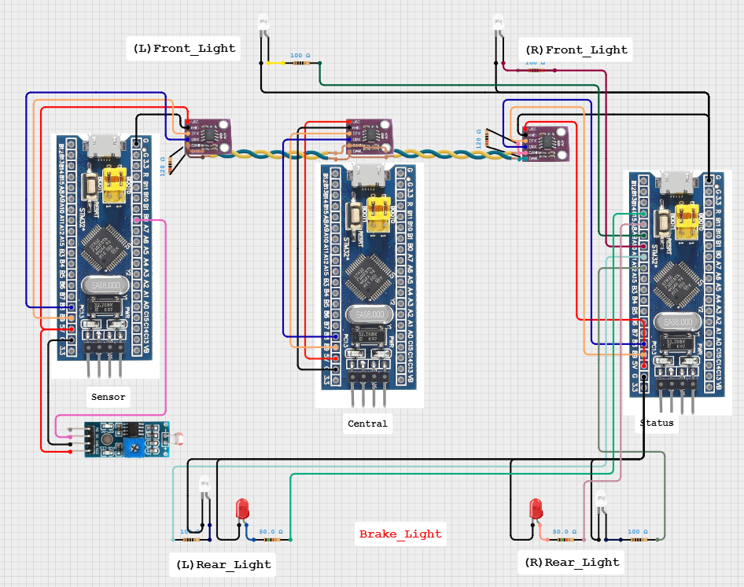

# LDR 기반 전/후진 및 브레이크 상태에 따라 전조등·후미등 제어 로직 추가 (v1.7.0)

## 📝 동작 요약
주변 밝기(LDR)와 차량의 주행 상태(전진/후진, 브레이크)를 종합하여 차량의 조명을 자동으로 제어한다.
1. Sensor MCU는 조도 센서(LDR) 값을 읽어 주변이 어두워지면 '어두움' 상태를 CAN 통신으로 전송한다.
2. Central MCU는 무선 조종기(RF) 신호를 받아 '전진/후진' 및 '브레이크' 상태를 CAN 통신으로 전송한다.
3. Status MCU는 두 MCU로부터 받은 CAN 데이터를 종합하여 다음 조건에 따라 LED를 점등한다.
    - 전조등: 주변이 어둡고 전진 상태일 때만 ON
    - 후미등: 주변이 어둡고 후진 상태일 때만 ON
    - 브레이크등: 주변 밝기와 상관없이 브레이크가 작동될 때 항상 ON

---

## 🔌 하드웨어 연결



---

## ⚙️ STM32CubeMX 설정

### sensor부
- LDR_IN (GPIO_Input) : PB0

### status부
- REAR_RIGHT_LED (GPIO_Output) : PA12
- REAR_LEFT_LED (GPIO_Output) : PA11
- FRONT_RIGHT_LED (GPIO_Output) : PA10
- FRONT_LEFT_LED (GPIO_Output) : PA9
- BRAKE_RIGHT_LED (GPIO_Output) : PA8
- BRAKE_LEFT_LED (GPIO_Output) : PB15

---

## 💻 코드 주요 로직

### 1. Sensor → Status: 조도(LDR) 데이터 전송
Sensor MCU는 조도 센서(LDR)를 읽어 주변이 어두운지 판단하고, 그 결과를 CAN ID 0x6A5 로 전송한다.

```c
// ... main 함수 내부 ...
uint8_t light_condition = HAL_GPIO_ReadPin(GPIOB, GPIO_PIN_0); 
if (light_condition == GPIO_PIN_RESET) 
  TxData[1] = 1; // 어두움 플래그
else
  TxData[1] = 0; // 밝음 플래그

CAN_Send();
```
- HAL_GPIO_ReadPin(GPIOB, GPIO_PIN_0): LDR 센서가 연결된 PB0 핀의 디지털 상태를 읽음 (어두울 때 Low(RESET) 신호가 들어오도록 설계)
- if (light_condition == GPIO_PIN_RESET): 만약 핀 상태가 Low라면, 어둡다고 판단
- TxData[1] = 1: 전송할 데이터의 두 번째 바이트([1])에 '어두움'을 의미하는 1을 저장합니다. 밝을 경우 0을 저장
- CAN_Send(): 이 TxData 배열을 포함한 CAN 메시지를 네트워크로 전송

### 2. Central → Status: 주행 및 브레이크 상태 전송
Central MCU는 RF 통신을 바탕으로 차량의 전진/후진 및 브레이크 상태를 CAN ID 0x321 로 전송한다.

```c
// ... main 함수 내부, RF 명령 수신 후 ...
// 전진/후진 + 브레이크 상태를 CAN으로 전송
uint8_t dir = cmd.direction;
uint8_t brake = (cmd.brake_ms > 0) ? 1 : 0; // 브레이크 명령이 있으면 1
CAN_Send_DriveStatus(dir, brake);

// <can_handler.c>
void CAN_Send_DriveStatus(uint8_t direction, uint8_t brake_status)
{
    CAN_TxHeaderTypeDef TxHeader;
    uint8_t TxData[2];
    uint32_t TxMailbox;

    TxHeader.StdId = 0x321;  // 메시지 ID: 0x321
    TxHeader.DLC = 2;        // 데이터 길이: 2바이트

    TxData[0] = direction;   // Data[0]: 방향 (1: 전진, 0: 후진)
    TxData[1] = brake_status;// Data[1]: 브레이크 (1: 작동, 0: 해제)

    HAL_CAN_AddTxMessage(&hcan, &TxHeader, TxData, &TxMailbox);
}
```
- main 함수에서 RF 명령(cmd)으로부터 방향(direction)과 브레이크 작동 여부(brake_ms > 0)를 추출
- CAN_Send_DriveStatus() 함수를 호출
- 이 함수는 ID 0x321 로 CAN 메시지를 설정하고, 전달받은 direction과 brake_status 값을 각각 데이터의 첫 번째와 두 번째 바이트에 담아 전송함

### 3. Status: CAN 데이터 수신 및 LED 점등
Status MCU는 Sensor와 Central로부터 CAN 메시지를 수신하여 상태를 종합하고, 최종 조건에 따라 전조등, 후미등, 브레이크등을 제어한다.

```c
// <can_handler.c>
// CAN 수신 인터럽트 콜백 함수
void HAL_CAN_RxFifo1MsgPendingCallback(CAN_HandleTypeDef *hcan)
{
    HAL_CAN_GetRxMessage(hcan, CAN_RX_FIFO1, &RxHeader, RxData);

    // Sensor로부터 온 조도 정보 처리 (ID: 0x6A5)
    if (RxHeader.StdId == 0x6A5 && RxHeader.DLC == 2)
    {
        // ... (status_distance = RxData[0];) ...
        status_light = RxData[1]; // 조도 상태 저장
    }
    // Central로부터 온 주행 정보 처리 (ID: 0x321)
    else if (RxHeader.StdId == 0x321 && RxHeader.DLC == 2)
    {
        status_direction = RxData[0]; // 주행 방향 저장
        status_brake = RxData[1];     // 브레이크 상태 저장
    }

    // 수신된 최신 정보로 LED 상태 즉시 업데이트
    LEDControl_Update(status_light, status_direction, status_brake);
}


// <led_control.c>
void LEDControl_Update(uint8_t ldr_dark, uint8_t direction, uint8_t brake)
{
    // ... (모든 LED 핀 초기화: OFF) ...

    // 전조등/후미등 제어 (어두울 때만)
    if (ldr_dark == 1) // status_light가 1이면(어두우면)
    {
        if (direction == 1) // 전진 시
        {
            // 전조등 2개 ON
            HAL_GPIO_WritePin(GPIOA, GPIO_PIN_9, GPIO_PIN_SET);
            HAL_GPIO_WritePin(GPIOA, GPIO_PIN_10, GPIO_PIN_SET);
        }
        else if (direction == 0) // 후진 시
        {
            // 후미등 2개 ON
            HAL_GPIO_WritePin(GPIOA, GPIO_PIN_11, GPIO_PIN_SET);
            HAL_GPIO_WritePin(GPIOA, GPIO_PIN_12, GPIO_PIN_SET);
        }
    }

    // 브레이크등 제어 (밝기와 무관)
    if (brake > 0) // 브레이크 상태가 1이면
    {
        // 브레이크등 2개 ON
        HAL_GPIO_WritePin(GPIOA, GPIO_PIN_8, GPIO_PIN_SET);
        HAL_GPIO_WritePin(GPIOB, GPIO_PIN_15, GPIO_PIN_SET);
    }
}
```
- HAL_CAN_RxFifo1MsgPendingCallback: CAN 메시지가 수신될 때마다 자동으로 실행되는 인터럽트 함수
- ID 0x6A5 수신 시: RxData[1](조도 정보) 값을 status_light 변수에 저장함
- ID 0x321 수신 시: RxData[0](방향), RxData[1](브레이크) 값을 각각 status_direction, status_brake 변수에 저장
- LEDControl_Update() 호출: 어떤 메시지를 받든, 콜백 마지막에서 이 함수를 호출해 즉시 LED 상태를 갱신함
- LEDControl_Update 함수 내부:
  - 전조등: 어둡고(ldr_dark == 1) 전진기어에 위치할 때 (direction == 1)라는 두 가지 조건이 모두 만족될 때만 켜짐
  - 후미등: 어둡고(ldr_dark == 1) 후진기어에 위치할 때 (direction == 0) 켜짐
  - 브레이크등: 브레이크가 작동 중(brake > 0) 이면, 주변 밝기나 주행 방향과 관계없이 항상 켜짐

---

## ❗문제 및 해결

### 문제 발생
LED 기능 추가 후 CAN 통신은 정상적으로 동작했으나, Central MCU와 컨트롤러 간의 RF 통신이 실패하는 문제가 발생

### 원인 분석 및 해결 과정

1. 모듈 테스트: m3_rf_comm 테스트 프로젝트를 통해 RF 모듈 개별 테스트를 진행한 결과, Central MCU에 연결된 트랜시버 모듈 자체의 고장으로 결론

2. 고장 원인 추정:
    - 브레드보드 내부의 잠재적인 단선 또는 접촉 불량
    -> 멀티미터로 실제 모듈 전압 측정 결과 3.2V로 정상 측정이 확인되어 쇼트 문제는 아닌 것으로 확인
    - 모듈 연결 시 실수로 3.3V가 아닌 5V 전원을 인가했을 가능성 (rf 트랜시버 모듈 datasheet 상 3.3v 연결 강조)
    - 코드의 비효율성으로 인한 모듈 과부하 및 회로 손상 가능성 

3. 해결:
    - 새 RF 트랜시버 모듈로 교체 후 모듈 테스트 결과 컨트롤러 측 모듈은 정상 동작 확인
    -> central부의 트랜시버 모듈이 고장인 것으로 확인
    - 회로의 물리적 안정성을 높이기 위해 Central MCU가 연결된 브레드보드를 새 것으로 교체
    - 추후 pcb설계를 통해 회로 안정화 필요 
 
---

## 💡 향후 확장 및 개선 아이디어
- FreeRTOS 기반 CAN 통신 모듈화 및 태스크 분리
- PCB 제작을 통한 회로 안정화
