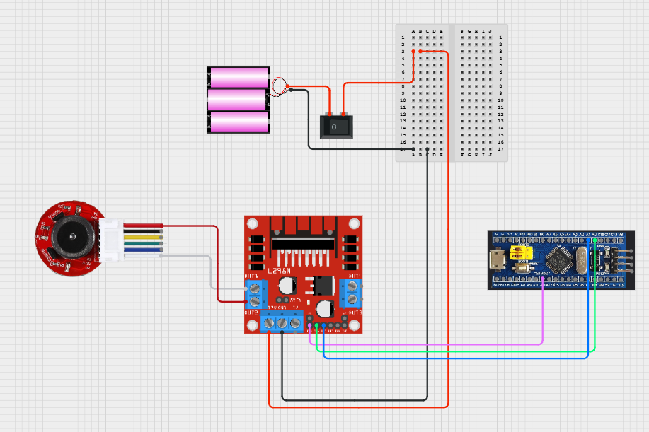

# [JGA25-370] PWM 듀티비 기반 DC모터 동작 로직 구현

## 🎯 프로젝트 활용 방안
본 프로젝트에서 DC 모터는 차량의 후륜 구동을 담당하며, 모터에 부착된 인코더를 통해 속도(RPM)를 측정하며, 모터 드라이버를 통해 회전 방향(전진/후진)을 제어한다. RPM은 sensor부에서 담당하며, 이는 추후 컨트롤러부의 OLED에서 디스플레이할 예정이다.

---

## 📖 이론 개요

### 1. JGA25-370 DC모터 with 인코더 동작 원리

#### 모터 사양
- Rated Volt : 12v
- Reduction ratio : 21.3:1
- No Load(무부하)
    - speed : 280rpm<br>
	- current : 60mA<br>
- At Load(부하)
    - Torque : 0.5KG.cm
	- speed : 220rpm
	- current : 0.45A
- Stall 
    - TOGQCE : 1.7KG..CM
	- current : 1.3A

#### DC모터 동작원리
- JGA25-370과 같은 브러시드 DC 모터는 입력 전압의 크기에 따라 회전 속도가 변하는 구조를 가지며, 이를 효율적으로 제어하기 위해 일반적으로 PWM(Pulse Width Modulation, 펄스 폭 변조) 방식이 사용된다.
- PWM 방식은 전압을 아날로그처럼 연속적으로 제어하는 대신, 디지털 신호의 ON/OFF 시간을 조절함으로써 모터에 **전력 공급의 평균값(평균 전압)**을 바꾸는 방식이다. 
    - 예를 들어, 100% 듀티 비는 전압이 계속 공급되는 상태(12V), 50% 듀티 비는 절반 시간만 공급되어 평균 약 6V, 10% 듀티 비는 약 1.2V의 평균 전압 효과를 내게 된다. 이에 따라 모터의 속도도 비례적으로 달라지게 된다.

- 다만, JGA25-370은 감속 기어가 포함된 고토크 저속 모터이기 때문에, 회전 시작 시 관성이 커서 일정 이상의 전압이 인가되어야 실제로 회전을 시작할 수 있다. 일반적으로 듀티 비 20~25% 이하에서는 모터가 회전하지 않고 데드존(Dead Zone) 현상이 발생해 소음만 존재하며, 실제 속도 제어가 되지 않는다. 따라서 유효한 제어 범위는 이 이상에서 시작된다.

- 하지만 너무 빠른 PWM 주파수는 감속기의 반응 속도나 모터의 기계적 특성 때문에 각 펄스의 세부적인 전력 변화에 모터가 민감하게 반응하지 못해, 오히려 제어 해상도가 떨어질 수 있다. 특히 JGA25-370과 같이 감속기가 포함된 고관성 모터는 회전 반응이 느리기 때문에 고주파 PWM의 빠른 듀티비 변화는 기계적으로 무시되거나 평균값으로만 반영되는 경우가 많다.
- 따라서 PWM 주파수는 모터가 실제로 반응할 수 있는 범위 내에서 설정하는 것이 중요하다. 일반적으로 브러시드 DC 모터의 경우 1kHz~20kHz 사이에서 동작하며, 너무 낮은 주파수는 출력이 끊기는 듯한 느낌을 줄 수 있고, 너무 높은 주파수는 실제 제어 효과가 무뎌지므로, 실험적으로 모터의 회전 반응성과 소음 수준을 고려해 최적 주파수를 선정해야 한다.


#### 홀 센서 방식의 회전 인코더
- JGA25-370 DC 모터에 장착된 인코더는 홀 센서 방식의 회전 인코더로, 회전축에 부착된 자석과 이를 감지하는 두 개의 고정된 홀 센서를 이용해 회전 속도와 방향을 측정한다. 회전 시 자석의 자기장 변화에 따라 홀 센서가 홀 전압을 발생시키고 이를 디지털 펄스로 변환하여 출력하며, 두 센서(A상, B상) 간의 위상차를 분석함으로써 회전 방향을 판단할 수 있다. 생성된 펄스 수를 시간에 따라 카운트하면 회전 속도(RPM)를 계산할 수 있다. 
- 홀 센서 방식은 해상도 면에서는 광학식보다 낮지만, 먼지, 진동, 오염에 강해 내구성이 뛰어나며, 산업용 및 차량용 모터 제어 시스템에 널리 사용된다.

##### 인코더 기본 구성
- 자석(Magnet): 모터 축에 부착되어 회전함
- 홀 센서(Hall Sensor): 자석의 N/S극 변화에 따른 자기장 변화를 감지하여 디지털 펄스를 출력

##### 인코더의 속도 측정 원리
1. 모터 회전 시, 자석이 홀 센서를 통과할 때마다 펄스 1개가 발생함
2. 일정 시간 동안 발생한 펄스 수를 세어 회전수를 계산함
3. 이를 바탕으로 회전속도(RPM)를 계산:
```text
RPM = (펄스 수 / TICKS_PER_REV) × (1초 / 측정 주기) × 60
```
- TICKS_PER_REV: 감속기 포함 실제 출력축 한 바퀴당 펄스 수
- STM32에서는 타이머 인터럽트나 주기 타이머를 통해 펄스 카운트를 주기적으로 측정함

##### 인코더의 방향 측정 원리 (쿼드러쳐(Quadrature) 기법)
   
|A상 신호|B상 신호|변화 순서|방향|
|:---:|:---:|:---:|:---:|
|↑|→|A상 상승 -> B상 상승|정방향 (CW)|
|→|↑|B상 상승 -> A상 상승|역방향 (CCW)|
- 회전 인코더에서 두 개의 홀 센서 신호 A상과 B상이 90도 위상차를 가지고 변화하면서, 신호 변화 순서에 따라 회전 방향을 측정할 수 있음

- 이 두 신호를 사용하면 펄스당 4번의 카운팅 (A 상승, A 하강, B 상승, B 하강)이 가능해져 4배 해상도의 정밀한 카운팅이 됨 **(x4 모드)**

- STM32의 Encoder 인터페이스 모드에서는 이 위상차를 자동으로 감지해 카운터 증가/감소로 방향을 판단


### 2. L298N 모터 드라이버 원리 (H-Bridge 방식)
L298N은 STMicroelectronics에서 제작한 듀얼 H-Bridge 모터 드라이버로, DC 모터나 스테퍼 모터를 양방향 제어하기 위해 설계되었다. 내부에는 두 개의 BJT 기반 H-Bridge 회로가 내장되어 있어, 하나의 L298N 칩으로 DC 모터 2개 혹은 스테퍼 모터 1개를 제어할 수 있다.

#### H-Bridge 기본 이론
H-Bridge 회로는 4개의 스위칭 소자(트랜지스터 또는 MOSFET)를 "H"자 형태로 배치하여, 전류의 방향을 양쪽으로 바꿀 수 있는 구조이다.

- 전류 방향 전환: 특정한 두 개의 스위치를 동시에 켜면 모터의 한 방향으로 전류가 흐르고, 다른 쌍을 켜면 반대 방향으로 흐름 → 모터 회전 방향 제어 가능

- PWM 제어: 상단 또는 하단의 트랜지스터 쌍에 PWM 신호를 입력하면, 전력의 평균값을 조절해 속도 제어가 가능함

#### PWM 주파수와 관련된 특성
L298N은 일반적으로 2kHz ~ 5kHz 사이의 PWM 주파수에서 안정적으로 동작하며, 이 범위를 벗어나면 다음과 같은 문제가 발생할 수 있다:

- 1kHz 이하의 저주파 : 모터 진동, 고주파 소음, 부드럽지 못한 회전 
- 10~20kHz의 고주파 : BJT의 스위칭 손실 증가 → L298N 발열 심화
출력 토크 감소, 효율 저하

※  Datasheet에서도 PWM 주파수에 대한 명시적인 권장치는 없지만, BJT 기반 스위칭 소자의 스펙과 실제 실험 결과를 보면 2~5kHz가 최적 동작 범위로 평가됨.

#### 왜 L298N은 고속 PWM에 적합하지 않은가?
- 스위칭 손실 증가: BJT는 MOSFET보다 on/off 시간이 느려, 빠른 PWM(예: 20kHz 이상)에서는 과도한 열 손실이 발생함

- 출력 저하: 빠른 스위칭 속도를 따라가지 못해 PWM 듀티비에 따른 출력 반응이 무뎌지고, 모터 토크가 줄어듦

- 발열 위험: 히트싱크 없이 사용 시, 고속 PWM + 고전류 조합은 **L298N 발열에 의한 열 차단(thermal shutdown)**을 유발할 수 있음


> [JGA25-370 datasheet](../datasheets/[JGA25-370]dc_motor_datasheet.pdf)<br>
> [L298N datasheet](../datasheets/[L298N]motor_driver_datasheet.pdf)<br>
> H-bridge 참고링크 : https://m.blog.naver.com/techref/222236636089<br>
> 인코더 참고링크 : https://blog.naver.com/gauya/220221704986
---

## 🔌 하드웨어 연결



|외부전원|L298N|F103보드|DC모터|
|:---:|:---:|:---:|:---:|
|+12V|+12v|||
|Gnd|Gnd|Gnd|-|
||Out1||Motor-(white)|
||Out2||Motor+(red)|
||IN1|PA0||
||IN2|PA1||
||ENA|PA11||

- 그라운드는 공통으로 묶어줘야함
- 점퍼핀 제거 후 ENA에 STM32의 PWM 핀(PA11)을 연결하면 모터 속도 제어가 가능하다. 
- ENA를 HIGH로 고정한 상태에서는 속도 조절 없이 ON/OFF 및 방향 제어만 된다.

---  

## ⚙️ STM32CubeMX 설정

## 1. Pinout 설정
- PA0, PA1 -> GPIO_Output (L298N IN1,2)
- PA11 -> TIM1_CH4 (PWM Generation)

### 2. TIM1 설정 - PWM
- Clock Source: Internal Clock
- Channel 3: PWM Generation CH4
- Configuration
    - Prescaler : 36-1 
    - Counter Period (ARR) : 1000-1


#### < TIM1의 타이머 클럭 계산 >
STM32F103C8T6에서 TIM1은 APB2 버스에 연결된 고성능 타이머이다. STM32F1 시리즈의 클럭 규칙에 따라 타이머의 동작 클럭이 결정된다.

- APB2 Prescaler = 1: 타이머 클럭 = APB2 클럭
- APB2 Prescaler > 1: 타이머 클럭 = APB2 클럭 × 2

일반적인 최대 클럭 설정에서 시스템 클럭(HCLK)과 APB2 클럭(PCLK2)은 모두 72MHz이며, APB2 Prescaler는 1로 설정된다. 따라서 TIM1에 공급되는 기본 타이머 클럭은 72MHz가 된다.

PWM 신호의 주기와 분해능을 결정하기 위해, 이 72MHz 클럭을 **Prescaler(PSC)**를 이용해 분주한다. 이 프로젝트에서는 **PSC 값을 35 (레지스터 설정값 36-1)**로 설정했다. 그 이유는 목표 PWM 주파수와 분해능을 고려했을 때, 타이머가 2MHz로 동작하는 것이 가장 이상적이기 때문이다.

- 타이머 카운팅 클럭 = 타이머 클럭 / (PSC + 1)
- 2MHz = 72MHz / (35 + 1)

따라서 PSC 값을 35로 설정하면, 타이머는 2MHz, 즉 0.5µs마다 한 번씩 카운트하게 된다.


#### < PWM 주파수 계산을 통한 ARR 설정  > 
ARR(Auto-Reload Register) 값은 타이머가 0부터 도달하는 최댓값으로, PWM의 주기와 분해능(정밀도)을 결정한다. 
ARR 값이 클수록 듀티비를 미세하게 조절할 수 있어 속도 제어가 부드러워지지만 PWM 주파수는 낮아지게 된다.
  
```latex
PWM주파수 (fpwm) = 타이머 카운팅 클럭 / (ARR+1)
```
RC카 제어에서는 모터의 반응성과 부드러운 속도 제어를 모두 만족시키는 것이 중요하다. 이를 위해 목표 PWM 주파수를 2kHz로, 제어 분해능은 약 10비트에 해당하는 1000단계로 설정했다.
이 목표를 달성하기 위해 위에서 계산된 2MHz의 타이머 카운팅 클럭을 사용하여 최적의 ARR 값을 도출했다.

위 식을 ARR에 대해 정리하면 다음과 같다.

- ARR = (타이머 카운팅 클럭 / PWM 주파수) - 1
- ARR = (2,000,000 Hz / 2,000 Hz) - 1
- ARR = 1000 - 1 = 999

결론적으로, STM32F103C8T6의 TIM1을 사용하여 2kHz의 PWM 신호를 생성하고 1000단계의 정밀한 제어 분해능을 확보하기 위해, Prescaler(PSC)는 35 (레지스터 값 36-1)로, Auto-Reload Register(ARR)는 999로 설정했다. 
이 설정은 RC카 제어에 필요한 빠른 응답성과 정밀도를 모두 만족시키는 최적의 조합이다.

---
## 💻 코드 주요 로직 설명
동작요약 : 이 코드는 HAL_GetTick()을 이용한 논블로킹 상태머신으로 정방향, 정지, 역방향, 정지를 순차적으로 반복하며, 각 상태에서 L298N의 IN1/IN2와 PWM 듀티비를 조절해 모터를 구동하고, TIM3 인코더 값을 주기적으로 읽어 delta 기반 RPM과 방향을 계산 후 Live Expressions에 변수로 지정하여 실시간으로 출력한다.

### 1. PWM 제어 (TIM1 CH4 사용)
- PWM 주파수: 약 2kHz (Prescaler=35, ARR=999)
- CCR 범위: 400 ~ 999로 설정
    - CCR / 999 × 100% → 듀티비 환산 가능
    - 예: CCR=400이면 약 40% 듀티비
- 이유:
20~25% 이하의 듀티비에서는 데드존(Dead Zone) 현상이 발생하기 때문에 듀티비가 너무 낮으면 모터가 회전하지 않고 소음만 발생하므로, 실질적인 회전을 위해 CCR 최소값을 400으로 설정함

### 2. HAL_Delay()를 사용하지 않는 이유
- HAL_Delay()는 괄호속의 시간 동안 CPU가 멈추는 blocking 함수로, 호출되는 시간 동안 **다른 코드(예: 통신, 제어 루틴 등)**이 전혀 실행되지 않음
    - 예: HAL_Delay(5000)은 5초 동안 아무 작업도 하지 않음
    - (즉, 멀티작업이나 정밀 측정이 필요한 시스템에서는 적합하지 않음)
- HAL_GetTick()을 사용하여 논블로킹 방식의 상태머신 구현을 통해 멀티태스킹처럼 동작을 병렬 처리할 수 있도록 설계

### 3. 실시간 관찰
```c
int motor_direction = 0; // 0: forward, 1: backward
```
- motor_direction 변수를 Live Expressions에 등록하여 실시간 속도 및 방향 변화 모니터링 가능

---

## 문제 해결 및 개선/확장

1. 모터 구동 시작 시 데드존(Dead Zone) 발생
- 현상: PWM 듀티비를 30% 이하로 설정 시, 모터가 회전하지 않고 '웅'하는 소음만 발생하는 현상 발견.
- 원인: JGA25-370 모터는 기어박스가 포함되어 있어, 정지 상태의 마찰력과 관성을 이겨내고 회전을 시작하는 데 필요한 최소 토크(전압)가 존재함. 이 최소 요구치 이하의 전압이 인가되는 구간이 데드존으로 작용.
- 해결: 실험을 통해 안정적으로 구동이 시작되는 **최소 듀티비를 약 40%**로 확인. 코드에서 모터 구동 시 PWM 레지스터(CCR)의 최솟값을 400으로 제한하여, 항상 유효한 범위 내에서만 모터가 동작하도록 개선함.

2. 정방향/역방향 급격한 전환 시 전류 스파이크 및 하드웨어 부담
- 현상: 모터가 한 방향으로 최대 속도로 회전 중에 즉시 반대 방향으로 명령을 내릴 경우, 모터 드라이버(L298N)에 과부하가 걸리고 모터가 심하게 요동침.
- 원인: 회전 중인 모터는 역기전력(Back-EMF)을 발생시키는데, 이때 반대 전압을 인가하면 매우 높은 전류가 순간적으로 흘러 드라이버와 모터에 무리를 줌.
- 해결: 논블로킹 상태 머신 설계 시, 정방향과 역방향 상태 사이에 반드시 '정지' 상태를 삽입함. 정지 상태(예: 2초) 동안 모터의 관성이 자연스럽게 줄어들도록 하여, 방향 전환 시 시스템에 가해지는 전기적/기계적 스트레스를 최소화하고 동작 안정성을 확보함.

---

## 향후 확장 및 개선 아이디어
- PID 기반 속도 제어 (Closed-Loop Control) 도입
	- 현재는 단순히 PWM 듀티비를 설정하는 개방 루프(Open-Loop) 방식이지만, 향후 Sensor부에서 측정한 RPM 값을 피드백 받아 PID 제어기를 구현할 수 있음.
	- 이를 통해 오르막길이나 내리막길 같은 부하 변동 상황에서도 설정된 목표 속도(Target RPM)를 일정하게 유지하는 정밀한 주행 제어가 가능해짐.

- FreeRTOS 도입을 통한 시스템 확장
	- 현재의 논블로킹 상태 머신을 FreeRTOS 기반의 멀티태스킹 시스템으로 전환할 수 있음.
	- 모터 제어, 센서 데이터 수신, 통신 처리 등을 각각 독립적인 태스크로 분리하여, 코드의 모듈성을 높이고 더 복잡한 기능을 안정적으로 추가할 수 있는 기반을 마련함.

- 가감속 프로파일링 (S-Curve) 적용
	- 현재는 목표 듀티비로 즉시 변경되지만, 가속 및 감속 시 PWM 듀티비를 점진적으로 변경하는 **'S-Curve 프로파일'**을 적용할 수 있음.
	- 이를 통해 **부드러운 출발과 정지(Soft Start/Stop)**가 가능해져 승차감을 개선하고 기어박스의 기계적 마모를 줄일 수 있음.

- 고효율 모터 드라이버로 교체
	- L298N은 발열과 전력 효율 측면에서 단점이 명확하므로, **MOSFET 기반의 모터 드라이버(예: TB6612FNG, DRV8833)**로 교체하여 시스템의 전력 효율을 높일 수 있음.
	- 드라이버 교체를 통해 배터리 사용 시간을 늘리고, 발열 문제를 근본적으로 해결할 수 있음.
