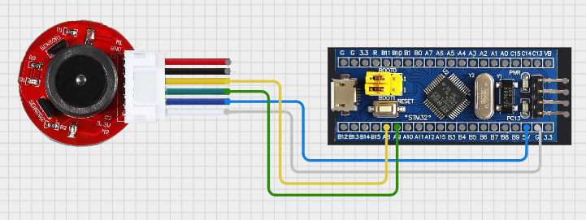
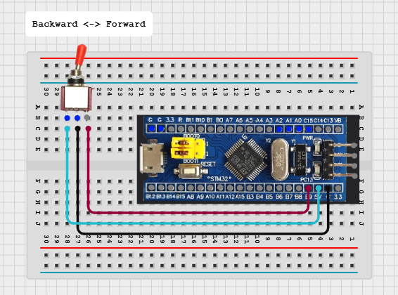

# Sensor부 Encoder 기반 RPM 측정 및 Controller부 토글스위치 기반 전/후진 기어변속 구현

## 프로젝트 활용 방안
- Sensor ECU: DC 모터의 회전 속도를 정밀하게 측정하여 차량의 속도 데이터로 활용 이를 추후에 컨트롤러에 디스플레이
- Controller : 사용자의 토글 스위치 입력을 받아 차량의 주행 방향(전진/후진)을 결정하고, 이를 무선 통신으로 차량에 명령
---

## 이론 개요

- 엔코더(Encoder) 기반 RPM 측정
    - STM32의 타이머(TIM)는 하드웨어 Quadrature Encoder Mode를 지원하여, 모터의 속도와 회전 방향을 최소한의 CPU 부하로 정밀하게 측정할 수 있다.
    - 엔코더의 A상과 B상 신호를 모두 사용하면 두 채널 간 위상 차이를 통해 회전 방향을 감지할 수 있으며, 각 펄스의 상승/하강 엣지를 모두 카운트하여 최대 4배의 분해능으로 정밀한 측정이 가능하다.

    > [자세한 엔코더 설명(Dc_Motor.md) 참고](./Dc_Motor.md)

- 토글 스위치로 전/후진 기어변속 구현
    - 3핀 토글 스위치는 가운데 공통(COM) 핀과 양쪽 단자를 가져, 한쪽은 전진(Forward), 다른 쪽은 후진(Backward) 신호 입력에 적합하다.
    - 스위치는 상태가 한번 결정되면 기계적으로 고정되는 특성이 있고 접점 노이즈가 거의 없어, 10~20ms 주기로 상태를 주기적으로 확인하는 폴링(Polling) 방식이 인터럽트 방식보다 안정적이고 구현이 간단하다.

---

## 하드웨어 연결





<Sensor>
- Encoder +5v (blue)
- Encoder Gnd(black)
- Encoder Signal A (yellow) : PA8 (TIM1_CH1)
encoder signal B(green) : PA9 (TIM1_CH2)

<Controller>
- PB9(Motor_Forward) : GPIO_Input
- PB8(Motor_Backward) : GPIO_Input
- Middle Pin : GND

---

## STM32CubeMX 설정

<Sensor>
Sensor ECU: TIM1 설정 - Encoder Mode
- Combined Channels: Encoder Mode
- Configuration > Parameter Settings
    - Encoder Mode: Encoder Mode TI1 and TI2 (A상, B상 모두 사용)
- Counter Settings
    - Prescaler: 0 (입력 클럭을 분주 없이 그대로 사용)
    - Counter Period (ARR): 65535 (0xFFFF, 16비트 타이머의 최댓값으로 오버플로우 방지)
Encoder Input Configuration
    - IC1 / IC2 Polarity: Rising Edge
    - IC1 / IC2 Filter: 10 (안정적인 신호 감지를 위해 디지털 필터 적용)

#### IC1/IC2의 Input Filter란?
엔코더 신호에 포함된 전기적 노이즈로 인한 잘못된 펄스 감지를 방지하는 디지털 필터 기능이다. 고속 회전이나 긴 배선으로 노이즈가 유입되면 RPM 값이 튀거나 제어가 불안정해질 수 있는데, 필터 값을 높이면 노이즈 제거에 효과적이다. (0~15 설정 가능)

<Controller>
- B8, PB9 핀 설정
    - Mode: Input
    - Pull-up/Pull-down: Pull-up (스위치가 연결되지 않았을 때 기본 상태를 HIGH로 유지)

---
## 코드 설명

### Sensor부: RPM 측정 동작 요약
motor_encoder.c의 Update_Motor_RPM() 함수는 아래와 같은 로직으로 주기적으로 호출되어 RPM을 계산하고 필터링한다. 

```c
// Sensor부 motor_encoder.c의 RPM 측정 핵심 로직
void Update_Motor_RPM(void)
{
    // 1. 이전 값과 현재 값 저장
    static int16_t last_encoder_count = 0;
    static uint32_t last_cycle_count = 0;

    // 2. 현재 엔코더 카운트 및 DWT 사이클 카운트 읽기
    uint32_t current_cycle_count = DWT->CYCCNT;
    int16_t current_encoder_count = (int16_t)__HAL_TIM_GET_COUNTER(&htim1);

    // 3. 변화량 계산
    uint32_t delta_cycles = current_cycle_count - last_cycle_count;
    int16_t delta_encoder = current_encoder_count - last_encoder_count;

    // 4. 다음 측정을 위해 현재 값 저장
    last_encoder_count = current_encoder_count;
    last_cycle_count = current_cycle_count;

    // 5. 경과 시간(초) 및 PPS(Pulse Per Second) 계산
    float delta_time_s = (float)delta_cycles / (float)SystemCoreClock;
    float pps = (float)delta_encoder / delta_time_s;

    // 6. RPM 계산 (TICKS_PER_REV: 기어비 등이 반영된 1회전당 총 틱 수)
    float raw_rpm = (pps / TICKS_PER_REV) * 60.0f;

    // 7. 저주파 통과 필터(IIR)를 적용하여 값을 부드럽게 처리
    filtered_rpm = (RPM_FILTER_ALPHA * raw_rpm) + ((1.0f - RPM_FILTER_ALPHA) * filtered_rpm);
    motor_rpm = filtered_rpm;
}
```

### Controller부: 토글스위치 기반 방향 전환 작동 원리

|토글스위치 위치|PB9 상태|PB8 상태|IN1 (central PA0)|IN2 (central PA1)|모터 회전 방향|
|---------|----|--------|---------|--------|----------|
|전진 (FWD)|LOW|HIGH|0 (LOW)|1 (HIGH)|정방향 회전|
|후진 (REV)|HIGH|LOW|1 (HIGH)|0 (LOW)|역방향 회전|

- 토글 스위치는 한 번 누르면 한 쪽으로 고정되어 LOW 상태가 지속되므로 폴링 방식이 적절함
- 둘 다 HIGH일 경우, 방향은 변경되지 않고 직전 설정 상태 유지된다.

#### 동작 원리:

1. PB9 핀의 상태를 읽는다. (HIGH/LOW)
2. 스위치가 전진(FWD) 위치에 있으면 PB9는 GND와 연결되어 LOW 상태가 되고, 함수는 LOCKER_FORWARD를 반환한다.
3. 스위치가 후진(REV) 위치에 있으면 PB9는 내부 풀업 저항에 의해 HIGH 상태가 되고, 함수는 LOCKER_BACKWARD를 반환한다.

---

## 개선사항 

### CubeMX에서 Peripheral 별 파일 분할

#### 설정 방법
1. CubeMX 실행 후 .ioc 파일 열기
2. 상단 메뉴에서<br>
    Project Manager > Code Generator 탭 선택
3. Generate peripheral initialization as a pair of '.c/.h' files per peripheral   
4. 저장 후 GENERATE CODE 클릭

- 이 설정이 되어 있지 않으면 main.c 내부나 stm32f4xx_hal_msp.c 등에 모든 초기화 코드가 모이게 된다.

#### Peripheral 별 파일 분할의 장점
- 가독성 향상
    - 각 주변장치의 설정이 해당 전용 파일에 명확히 구분되므로, 코드를 파악하고 수정하기 쉬워짐
- 유지보수 용이
    - 예를 들어 I2C 설정만 바꾸고 싶을 때 i2c.c만 보면 되며, 다른 설정과 충돌하지 않도록 관리가 용이함
- 빌드 속도 개선
    - 변경이 발생한 .c 파일만 컴파일되므로, 프로젝트 규모가 클수록 빌드 시간 감소에 효과적임
- Git 버전관리 효율 
    - 기능별로 커밋이 가능하므로 이력 관리가 체계적으로 됨. (예: tim.c만 수정한 경우 diff 확인이 쉬움)
- 팀 협업에 유리
    - 여러 사람이 동시에 I2C, TIM 등 서로 다른 기능을 작업할 수 있어 충돌 가능성이 줄어들게 됨

--- 

## 💡 향후 확장 및 개선 아이디어

- Sensor ECU: 현재 RPM 측정에 사용된 저주파 통과 필터의 계수(RPM_FILTER_ALPHA)를 주행 환경에 따라 동적으로 조절하여 반응성과 안정성 사이의 균형을 최적화하는 방안을 연구할 수 있다.

- Controller ECU: 현재 폴링 방식으로 처리되는 스위치 입력을, 상태 변경 시에만 이벤트가 발생하는 외부 인터럽트(EXTI) 방식으로 변경하여 CPU 점유율을 최소화하는 리팩토링을 고려할 수 있다. (단, 디바운싱(Debouncing) 로직 추가 필요)

 
