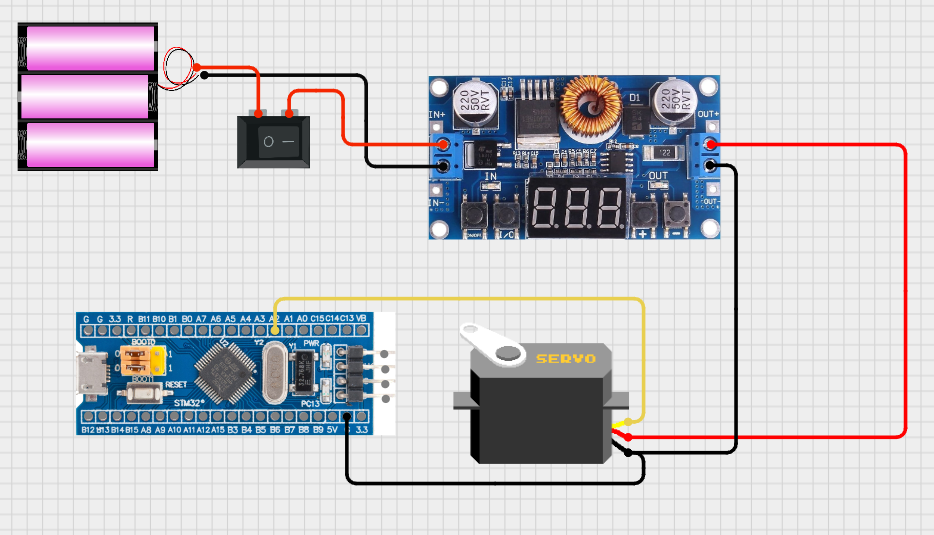

# [MG996R] 서보모터 동작 로직 구현

## 프로젝트 활용 방안
본 프로젝트에서 서보모터는 차량의 전륜 조향을 담당하며, 핸들에 부착된 자이로센서의 실시간 센싱 데이터를 기반으로 조향 각도를 제어한다.

---

## 이론 개요

### MG996R 서보모터와 PWM 동작원리
- 서보모터는 PWM(Pulse Width Modulation) 신호를 통해 제어되며, 이 신호는 일정한 주기(보통 20ms, 즉 50Hz)를 가지는 펄스 형태이다.
이때 펄스의 High 상태(ON 시간), 즉 펄스 폭(Pulse Width)에 따라 모터의 회전 각도가 결정된다.
- 서보모터 동작에서 듀티비(Duty Cycle)는 전체 주기 중 High 상태가 차지하는 비율을 의미하며, 이 듀티비(또는 펄스 폭)가 서보의 위치를 결정한다.
- MG996R과 같은 서보모터의 경우 일부 제품은 0.5ms ~ 2.5ms까지도 지원하지만, 안정적인 동작을 위해 일반적으로 1.0ms ~ 2.0ms 범위의 펄스 폭에 따라 약 -90° ~ +90° 사이의 각도로 회전한다.


> [MG996R datasheet](../datasheets/MG996R_datasheet.pdf)<br>
> 참고링크 : https://www.youtube.com/watch?v=HN9sKhKxy7M
---

## 하드웨어 연결



<br>
MG996R 서보모터는 안정적인 동작을 위해 4.8V~7.2V의 전압이 요구된다. 그러나 STM32 보드의 5V 핀은 전류 공급 능력이 500mA 이하로 제한되어 있어, 부하가 걸릴 경우 순간적으로 최대 2.5A까지 전류를 요구하는 MG996R에 충분한 전력을 공급하기 어렵다. 이에 따라, VCC와 GND는 배터리에서 스텝다운 컨버터를 통해 5V로 강압한 외부 전원에 연결하여 안정적인 전원 공급이 가능하도록 구성하였다.

<br><br>
### 연결
|MG996R|외부 전원|F103 보드|
|:---:|:---:|:---:|
|Vcc|+5V|-|
||공통 Gnd||
|PWM|-|PA2|


---  

## STM32CubeMX 설정
Click Timer → Click TIM2 →
- Channel3 set to PWM Generation CH3
Configuration → Parameter Settings →
- Prescaler set to 72-1
- Counter Period : 19999

### 1. PWM 주기 계산
- 서보모터가 요구하는 PWM 주기인 20ms(50Hz)를 맞추기 위해 타이머 클럭과 Prescaler, Counter Period의 값을 조합하여 계산하며, 공식은 다음과 같다.<br>

```latex
PWM 주기 (T) = ((Counter Period + 1) × (Prescaler + 1)) / Timer Clock(Hz)
```

#### 타이머 클럭(Hz) 계산
- STM32F103C8T6의 시스템 클럭은 일반적으로 72MHz로 설정된다.
- TIM2는 APB1 버스에 연결되어 있으며, APB1 Prescaler가 1보다 클 경우 타이머 클럭은 APB1 클럭의 2배가 된다. (APB1 클럭 36MHz * 2 = 72MHz)
- 결과적으로 TIM2에 공급되는 최종 클럭은 72MHz가 된다.

#### PWM 주기 계산 적용
위 설정값과 클럭을 공식에 대입하면 다음과 같다.

```latex
PWM 주기 (초) = ((19999 + 1) × (71 + 1)) / 72,000,000 Hz
             = (20000 × 72) / 72,000,000
             = 1,440,000 / 72,000,000 = 0.02초 = 20ms
```

### 2. PWM 주파수 계산
```latex
주파수(f) = 1 / 주기(T) = 1 / 0.02s = 50Hz
```

### 3. 펄스 폭(Pulse Width) 계산
펄스 폭(Pulse Width)은 PWM 신호에서 High 상태가 유지되는 시간을 의미하며, 이는 타이머의 설정 값(Prescaler, Period, Compare Value)에 따라 결정된다. PWM 출력에서 __HAL_TIM_SET_COMPARE() 함수로 설정하는 값은 타이머 카운트 기준의 Compare Match 값으로, 곧 High 상태가 유지되는 시간(카운트 수)을 나타낸다.

PWM 신호의 High 구간 길이는 __HAL_TIM_SET_COMPARE() 함수로 설정하는 Compare 값에 의해 결정된다. 타이머가 1카운트 하는 데 걸리는 시간(Tick 시간)은 다음과 같다.

```latex
Tick 시간 = (PSC + 1) / 타이머 클럭 = 72 / 72,000,000Hz = 1µs
```

따라서 최종 펄스 폭은 Compare 값과 같다.

```latex
펄스 폭(µs) = Compare 값 × 1µs
```

### 4. 듀티비(Duty Cycle) 계산
듀티비란, PWM(펄스 폭 변조, Pulse Width Modulation) 신호에서 하나의 주기 동안 신호가 High 상태로 유지되는 비율을 뜻하며, 백분율(%)로 다음과 같이 계산한다.

```latex
듀티 비(%) = High 상태 시간 / 전체 주기 시간 × 100
```

- 듀티비가 높다 -> High 상태가 더 길다 -> 서보가 더 많이 회전
- 듀티비가 낮다 -> High 상태가 짧다 -> 덜 회전

※ STM32 같은 MCU에서는 TIMx->CCR 레지스터로 이 듀티비를 설정한다.

<br>
서보모터는 듀티비 자체보다는 펄스 폭(ms)을 해석하지만, 주기가 20ms로 고정된 상태에서는 펄스 폭과 듀티비가 직접 연결된다.<br>
ex) 1.5ms Pulse = 20ms 주기 -> 7.5% Duty Cycle

---
#### 서보모터 PWM 듀티비 기반 조향 각도 매핑 구현 및 좌/우 조향 한계각 보정

## 코드 설명
동작 요약 : 차량 섀시의 하드웨어 형태에 맞게 설정한 조향 한계값 범위 내에서 Compare 값(펄스 폭)을 변경하여 중립, 우회전, 좌회전 순서로 조향을 반복한다. 

### main 함수 동작 요약
```c
HAL_TIM_PWM_Start(&htim2, TIM_CHANNEL_3);  // TIM2 채널 3(PA2)에서 PWM 시작
```

```c
while (1)
{
  __HAL_TIM_SET_COMPARE(&htim2, TIM_CHANNEL_3, 1200); // 우회전 최대 (roll -90°): Compare = 1200 → 1.2ms 펄스 폭
  HAL_Delay(1000);
  
  __HAL_TIM_SET_COMPARE(&htim2, TIM_CHANNEL_3, 1900); // 좌회전 최대 (roll +90°): Compare = 1900 → 1.9ms 펄스 폭
  HAL_Delay(1000);
}
```

- 차량 섀시에 닿지 않는 좌우 한계각 범위 내에서 서보모터를 제어하기 위해, Compare 값에 따른 펄스 폭을 계산한다. 
- Tick 시간이 1µs이므로 Compare 값 1200은 1.2ms, 1900은 1.9ms의 펄스 폭에 해당하며, 이 범위를 실제 조향의 좌/우 최대 한계로 설정한다.
- while 루프는 중립 위치 없이, 설정된 최대 우회전(Compare: 1200)과 최대 좌회전(Compare: 1900) 위치를 1초마다 반복적으로 직접 전환하도록 구성한다.

> 참고링크<br>
: https://www.micropeta.com/video102<br>
: https://m.blog.naver.com/compass1111/221163124212<br>
: https://m.blog.naver.com/emperonics/221725399383<br>

---

## 문제 해결 및 개선/확장

### 문제상황 1.
전원을 공급할 때마다 배터리를 홀더에서 탈부착해야 하는 번거로움이 있었다.  <br>
**해결** : 회로의 기준점(Gnd)을 항상 유지하면서 전체 회로에 안전하게 전원을 차단할 수 있도록 + 쪽의 전선 중간에 로커 스위치(정격 3A 250V AC)를 추가하였다. 

---

## 향후 확장 및 개선 아이디어
- 자이로센싱 값 기반 서보모터 조향 로직 통합
- 오실로스코프 PWM 파형 시각화


