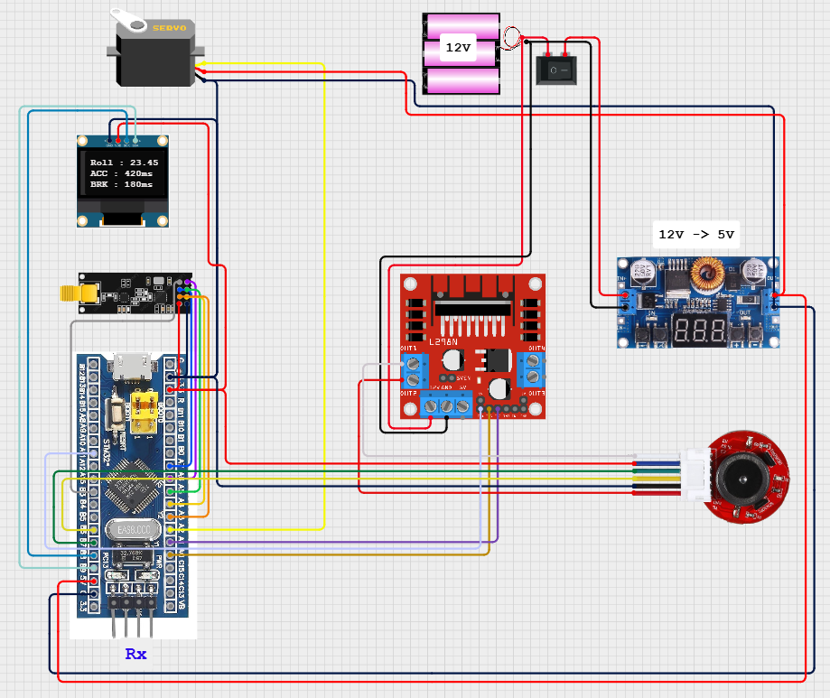

# RF 송수신 모터 제어 통합 구현 (v1.0.0)

## 프로젝트 활용방안
- 본 프로젝트는 무선 조종 RC카의 수신부(Rx) 핵심 제어 시스템을 구현한다.
- 조종기(Tx)로부터 NRF24L01+ 모듈을 통해 자이로 센서의 roll 값과 accel_ms(가속), brake_ms(브레이크) 버튼의 눌림 시간을 실시간으로 수신한다. 수신된 roll 값은 서보 모터의 조향 각도로 변환되어 정밀한 비례 제어 조향을 가능하게 한다. 또한, accel_ms와 brake_ms 값을 기반으로 DC 모터의 PWM 듀티를 동적으로 조절하여, 단순한 ON/OFF가 아닌 직관적인 가속, 제동 및 자연스러운 감속(Coasting) 기능을 구현한다.

--- 

## 하드웨어 연결

### 수신부(Rx)


※ 송신부(Tx)는 [M3_RF_Communication.md](./M3_RF_Communication.md)와 동일

---

## STM32CubeMX 설정
※ 송신부(Tx)는 [M3_RF_Communication.md](./M3_RF_Communication.md)와 동일

> 이전 개발일지 참고 :<br>
[Dc_Motor.md](./Dc_Motor.md)<br>
[Servo_Motor.md](./Servo_Motor.md)

1. DC모터 PWM_ENA
- pa11 (tim1_ch4)
- pwm generation ch4
- prescaler : 36-1
- Counter Period : 999

2. DC모터 방향 설정
- pa0 (gpio_output) :l298n_in1
- pa1 (gpio_output) :l298n_in2

3. servo모터
- Pin # -> PA2
- Click Timer → Click TIM2 →
Clock Source set to Internal Clock
- Channel3 set to PWM Generation CH3
- Configuration → Parameter Settings →
- Prescaler set to 72-1
- Counter Period : 19999

---

## 동작 코드
※ 기존 송신부(Tx)의 로직과 수신부(Rx)의 로직은 [M3_RF_Communication.md](./M3_RF_Communication.md)와 동일

### 추가된 수신부(Rx) 모터 동작 로직
```c
while(1)
{
    // 서보모터, DC모터 제어 로직 함수 분리
    Control_Servo(roll);
    Control_DC_Motor(accel_ms, brake_ms);
}

// 서보 모터 제어 함수
void Control_Servo(float roll)
{
	if (roll < -90.0f) roll = -90.0f;
	if (roll >  90.0f) roll = 90.0f;

	// roll [-90 ~ 90] → angle [0 ~ 180]
	float angle = roll + 90.0f;

	// servo pwm : 우회전최대 = 1200, 중립 = 1550, 좌회전최대 = 1900
	uint16_t pwm_servo = (uint16_t)(1200 + (angle / 180.0f) * (1900-1200));

	// 출력 제한 (안정성 보장)
	if (pwm_servo < 1200) pwm_servo = 1200;
	if (pwm_servo > 1900) pwm_servo = 1900;

	__HAL_TIM_SET_COMPARE(&htim2, TIM_CHANNEL_3, pwm_servo);
}

// DC 모터 제어 함수
void Control_DC_Motor(uint16_t accel_ms, uint16_t brake_ms)
{
    static int16_t duty = 0;  // PWM duty값 (static으로 유지)
    const int16_t accel_step = 10;     // 가속 증가폭
    const int16_t brake_step = 30;     // 브레이크 감소폭
    const int16_t max_duty = 1000;     // 최대 duty (ARR와 맞춰야 함)

    // 1. 브레이크 우선 처리
    if (brake_ms > 0)
    {
        duty -= brake_step;
    }
    // 2. 가속 입력 처리
    else if (accel_ms > 0)
    {
        if (duty == 0)
            duty = 200;  // Deadzone 극복을 위한 초기값 설정

        duty += accel_step;
    }
    // 3. 엑셀에서 발 뗀 상태 → 감속
    else if (accel_ms == 0)
    {
        duty -= accel_step;
    }

    // 4. PWM duty 범위 제한
    if (duty < 0)
        duty = 0;
    if (duty > max_duty)
        duty = max_duty;

    // 5. PWM 출력 적용 (htim1, TIM_CHANNEL_4 사용)
    __HAL_TIM_SET_COMPARE(&htim1, TIM_CHANNEL_4, duty);
}


```

---

## 향후 확장 및 개선 아이디어
- v1.1.0 업데이트 (encoder 기반 rpm 디스플레이 및 로커스위치로 전/후진 기어변속 기능 추가)
- FreeRTOS를 도입하여 서보모터 제어, DC 모터 제어, RF 수신 기능을 각각 태스크로 분리하여 병렬 처리 구조 구현
- 차량 RC 테스트 결과 조향범위와 dc모터의 출력 로직 수정 필요
