# 개발 간 사용한 보드 및 모듈

**Board**
| 품목 | 용도 | 수량 | 이미지 |
| :------: | :------: |:------: |:------: |
| STM32F103C8T6 | controller MCU   car_central ECU   car_status ECU   car_sensor ECU |4| 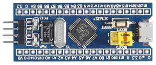|
 

**Sensor**
| 품목 | 용도 | 수량 | 이미지 |
| :------: | :------: |:------: |:------: |
| [MPU-6050] 6축 IMU 센서 | controller - 모션 제어|1|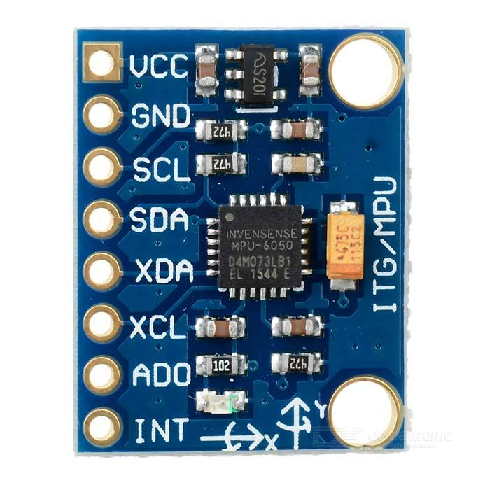|
|[HC-SRO4] 초음파센서|전/후방 장애물 감지|2|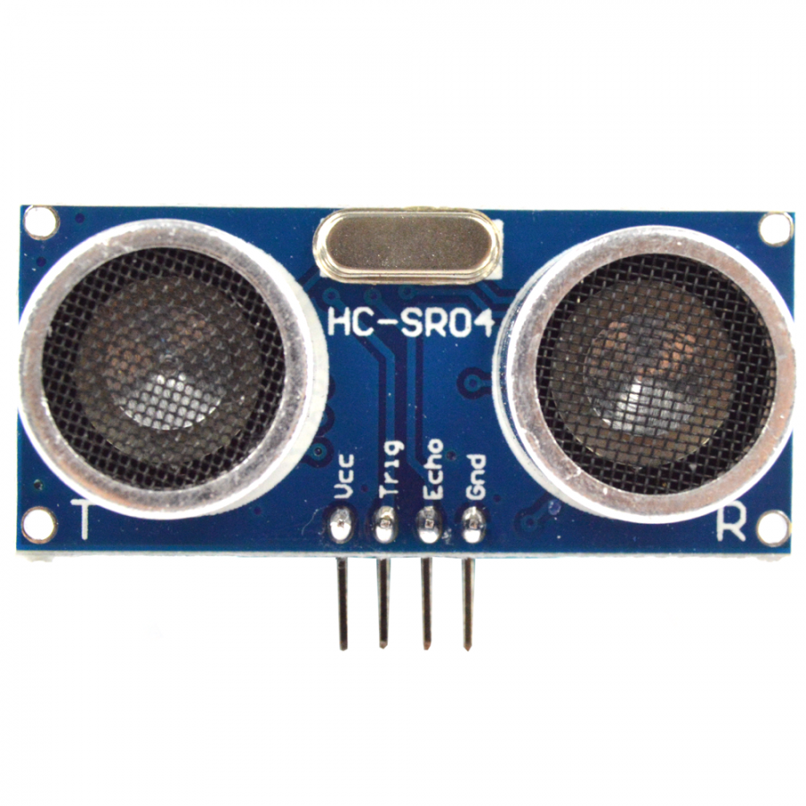|
|[LM393 ldr] 조도센서|주변 밝기 판단|1|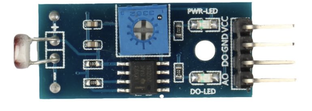|
 

**Communication module**
| 품목 | 용도 | 수량 | 이미지 |
| :------: | :------: |:------: |:------: |
|[NRF24L01+PA+LNA] 2.4G 무선 모듈|car-controller RF 통신|2|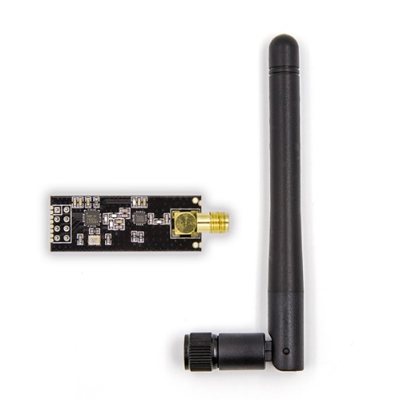|
|[MCP2551] CAN 트랜시버 모듈| car - can 통신 |3|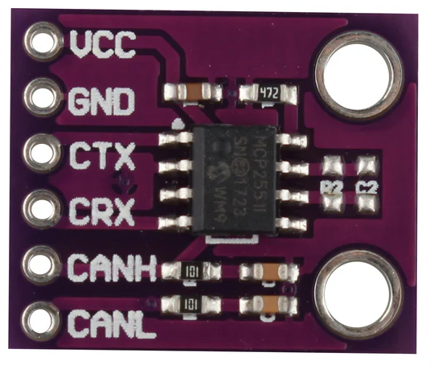|
 

**Motor**
| 품목 | 용도 | 수량 | 이미지 |
| :------: | :------: |:------: |:------: |
|[JGA25-370] DC모터|내부 인코더를 통해 dc모터의 RPM 확인가능|1|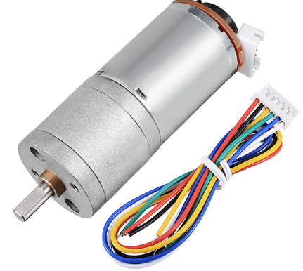|
|L298N|Dc motor driver - DC모터 PWM 제어 및 방향 변경|1|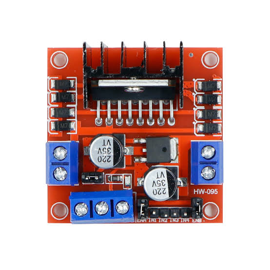|
|진동모터|controller - 충돌 경고 핸들 진동|2|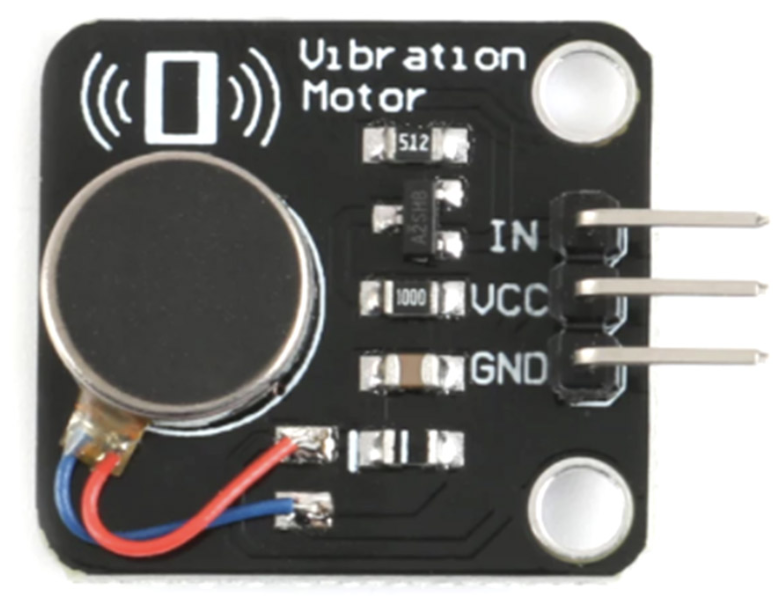|
|[MG996R]servo 모터|전륜 조향|1|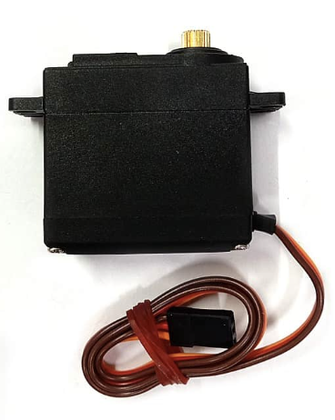|
 

**Etc**
| 품목 | 용도 | 수량 | 이미지 |
| :------: | :------: |:------: |:------: |
|RC카 섀시, 휠|차량의 뼈대|1|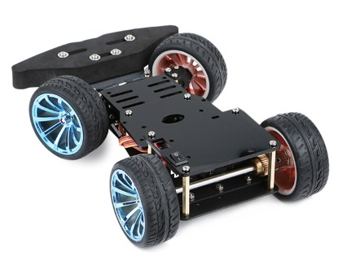|
|Locker 스위치| car - 배터리 on/off |1|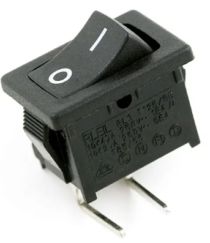|
|토글 스위치| controller - 기어변속|1|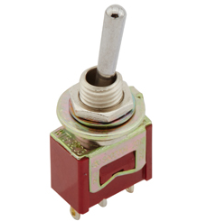|
|tactile 스위치|브레이크,악셀 버튼용|2|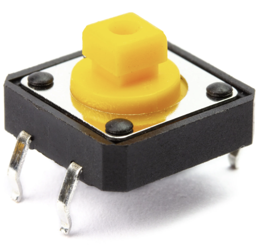|
|LED|전조등, 후미등, 브레이크등|6|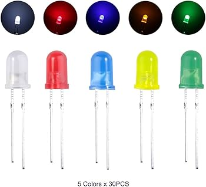|
|OLED 디스플레이| controller - 주행 중 현황 확인   car - 차량 상태 확인 |2|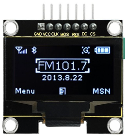|
|충전형 18650 리튬 배터리(3000mAh)| car - 3s   controller - 2S|5|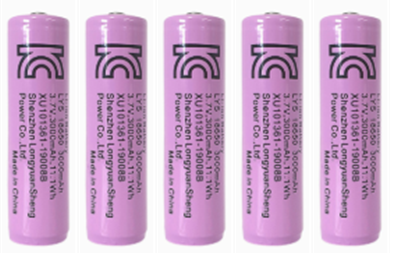|
|DC 스텝다운 컨버터| MCU 5V 전압공급 목적 강압   car : 12v->5v   controller : 8v->5v |2|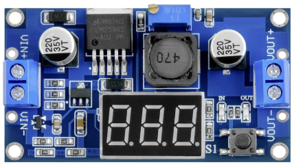|
|저항|120옴 - CAN 종단저항(3)   100옴 - LED용(6)|9|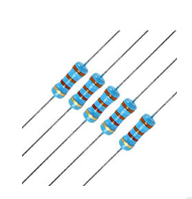|

